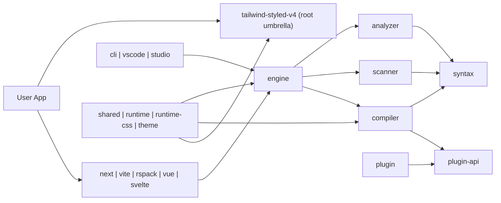

## Approved V2 Direction

### Status
- `Approved`
- Official direction: `tanpa mengurangi fungsi + memperkuat fungsi lama + menambah fungsi baru`
- Execution snapshot: `2026-03-29` root `build`, `check`, `test`, dan `pack:check` sudah diverifikasi hijau.
- Current delivery state: Wave 4 observability untuk `doctor`, `trace`, `why`, engine metrics, dan dashboard summary/health sudah masuk production prototype.
- Current open gap: `devtools traces`, shared trace/inspection surface lintas tooling, dan plugin starter masih pending.

### Document Map
- Visual architecture reference: `plans/monorepo-restructure-v2-mermaid.md`
- Execution checklist: `plans/monorepo-restructure-v2-checklist.md`
- Per-package execution map: `plans/monorepo-restructure-v2-package-breakdown.md`
- Execution log / handoff notes: `plans/monorepo-restructure-v2-execution-log.md`
- Baseline migration and workspace-green history remain in this file below.

### Current Execution Snapshot
- Latest verified gate date: `2026-03-29`
- Verified commands: `npm.cmd run build`, `npm.cmd run check`, `npm.cmd test`, `npx.cmd turbo run pack:check --continue`
- Production prototype yang sudah aktif:
  - CLI: `tw doctor --cwd <path> --include workspace,tailwind,analysis`, `tw trace <class>`, `tw trace --target <path>`, `tw why <class>`
  - Engine: metrics write ke `.tw-cache/metrics.json` untuk build success, watch update, dan error path
  - Dashboard: `/metrics`, `/history`, `/summary`, `/health`, dan reset history surface
- Recommended next execution target: perluas trace/inspection ke `devtools` di atas shared observability API, lalu lanjutkan plugin starter/codegen bila coupling-nya tetap tipis.

### Official Execution Order
1. Preserve compatibility shell.
2. Strengthen old functions: typing, tests, diagnostics, fallback behavior, and packaging safety.
3. Add new capabilities: engine facade growth, `doctor`, `trace`, `why`, plugin ergonomics, and richer tool surfaces.
4. Keep delivery gates green: `build`, `check`, `test`, `pack:check`, and desktop packaging.

### Canonical Acceptance Criteria
- Root import, root subpath import, and direct import `@tailwind-styled/*` stay compatible.
- Existing user-facing features are not removed.
- Existing functionality becomes more stable, more typed, better tested, and easier to inspect.
- Type safety and runtime safety improve together through the `TypeScript + Zod` combination.
- New capabilities stay additive and optional.
- Workspace gates remain green.

### TypeScript + Zod Direction
- Official typing policy: use `TypeScript + Zod` together as the default pattern across the monorepo.
- Intent: `TypeScript` handles compile-time contracts, inference, editor tooling, and internal composition, while `Zod` validates runtime inputs and outputs at system boundaries.
- This is a deliberate `simbiosis mutualisme`: TypeScript makes code safer to write and refactor, while Zod makes real runtime data safer to trust.
- Apply Zod at boundaries such as config loading, CLI input, environment variables, JSON/cache files, adapter/plugin options, IPC payloads, native binding results, and any `unknown` data entering the system.
- Prefer schema-co-located types: define schema first or alongside the type, then derive the runtime-safe type with `z.infer<typeof Schema>`.
- Shared contracts that cross package boundaries should live in shared schema modules when they are reused broadly; package-local contracts may stay local to the package.
- After data is validated at the boundary, internal hot paths may continue with plain typed objects without repeatedly re-validating the same payload.
- Avoid `TypeScript-only` assumptions for untrusted runtime data, and avoid `Zod-only` usage without strong TypeScript inference for developer ergonomics.

### TypeScript + Zod Cross-Check
#### Policy
- [x] The repo uses TypeScript broadly for static contracts.
- [x] Zod is already part of the monorepo dependency model and can be used as the runtime validation layer.
- [x] Every new TypeScript-facing feature should declare whether it has a runtime boundary that needs Zod validation.

#### Boundary Rules
- [x] No public or cross-package `unknown` payload should be trusted without schema validation.
- [x] Native binding responses should be validated before entering domain logic.
- [x] JSON, cache, manifest, and config reads should be parsed into typed schema-backed values.
- [x] CLI, adapter, and plugin options should be validated at entry points, not deep inside execution flow.

#### Authoring Rules
- [x] Prefer `z.infer<typeof Schema>` over manually duplicated interface definitions when the same structure needs runtime validation.
- [x] Keep schema names explicit and domain-oriented, for example `NativeReportSchema`, `AnalyzerOptionsSchema`, or `PluginOptionsSchema`.
- [x] Co-locate schemas with the package boundary they protect, or lift them into shared modules when reused across packages.
- [x] Keep error messages human-readable so validation failures help debugging instead of only failing fast.

#### Performance Rules
- [x] Validate once at the boundary, then pass trusted typed values inward.
- [x] Do not add repeated Zod parsing in hot loops or performance-critical inner transforms without a proven need.
- [x] Prefer schema-backed normalization near I/O edges and plain TypeScript objects in internal computation paths.

#### Done When
- [x] Boundary data across the monorepo is validated consistently.
- [x] Types and schemas no longer drift apart in important package contracts.
- [x] Runtime failures from malformed external data become rarer and easier to diagnose.
- [x] TypeScript and Zod are used as complementary tools, not competing styles.

### Official Cross-Layer Stack Recommendation
- Default cross-layer stack: `TypeScript + Zod + neverthrow + ts-pattern + Rust (serde + schemars + napi-rs)`.
- `TypeScript` remains the primary static contract layer for package internals, inference, IDE tooling, and refactors.
- `Zod` remains the default runtime validation layer at boundaries where data enters from config, JSON, CLI, adapters, plugins, IPC, or native bindings.
- `neverthrow` is the recommended Result-style error flow for native, I/O, and boundary-heavy paths where `try/catch` would otherwise spread through the codebase.
- `ts-pattern` is the recommended exhaustive branching tool for discriminated unions returned by adapters, plugins, scanners, analyzers, and Rust/native bridges.
- `Rust` should use `serde` for serialization, `schemars` for schema export, and `napi-rs` for Node bindings when a native module crosses into TypeScript.
- Optional Rust layer hardening such as `nutype` or `garde` is encouraged when domain values need stronger validation or normalization close to the native boundary.
- The stack should stay intentionally small: do not introduce multiple competing schema systems as defaults when `TypeScript + Zod` already covers the same problem well enough.
- Do not make `tRPC`, `Immer`, `Effect`, `Valibot`, `ArkType`, or `TypeBox` baseline requirements for the monorepo; they may be adopted only for a package with a concrete need and an explicit justification.

### Stack Guardrails
- `Zod` is the default runtime schema language unless a package has a documented reason to use another schema tool.
- `neverthrow` is preferred over ad-hoc custom `Result` types for new boundary-heavy TypeScript code.
- `ts-pattern` is preferred when a discriminated union has more than two meaningful runtime branches and missing a branch would be risky.
- `serde + schemars + napi-rs` should be treated as the default Rust-to-TypeScript bridge path for new native-facing modules.
- Avoid duplicating the same contract in three forms by hand when one of them can be generated or derived.
- Avoid adding library churn: one package should not mix multiple validation libraries unless there is a strong performance or interoperability reason.

### Future Module Direction
- Official long-term target: `full ESM-only`.
- Near-term policy: stay `ESM-first`, keep dual `import`/`require` exports only where compatibility is still needed.
- Do not do repo-wide `dist/esm` + `dist/cjs` split yet unless a package has a concrete runtime/build problem that truly needs separate artifacts.
- Do not fake `import.meta.url` with global build-time replacement; prefer runtime helpers that are correct in both ESM and compatibility CJS output.
- New code should assume ESM semantics first: file URLs, `createRequire` only when truly needed, and no new CJS-only API surface unless the host runtime requires it.
- Host-specific packages may remain format-specific when the platform demands it, for example VS Code extension host or Electron main process.

### ESM Migration Cross-Check
#### Current Direction
- [x] Source direction is already `ESM-first` in the monorepo.
- [x] Root and workspace packages still preserve dual-format compatibility for current consumers.
- [x] PLAN acceptance remains `compatibility-preserving`, not a forced breaking migration.

#### Guardrails
- [x] No new package should be designed as `CJS-first`.
- [x] No new public API should require `require(...)` as the preferred consumption path.
- [x] No build config should rely on fake global replacement of `import.meta.url`.
- [x] No migration step should remove existing features just to simplify module format decisions.

#### Wave 1: Internal ESM Hardening
- [x] Audit `analyzer`, `compiler`, `scanner`, `next`, `rspack`, and `cli` for CJS-only assumptions around paths, loaders, native bindings, and worker/bootstrap resolution.
- [x] Replace remaining fragile dirname/require fallbacks with shared ESM-safe runtime helpers where appropriate.
- [x] Ensure loader path resolution works from runtime location, not from source-layout assumptions.
- [x] Keep `build`, `check`, `test`, and `pack:check` green after each package-level cleanup.

#### Wave 2: Consumer and Export Readiness
- [x] Confirm examples and smoke tests work through `import`-first consumption paths.
- [x] Keep root import, root subpath import, and direct `@tailwind-styled/*` imports working while dual exports remain.
- [x] Add or maintain explicit compatibility tests for packages that still expose both `import` and `require`.
- [x] Identify which public packages still have real CJS consumers before removing any `require` export path.

#### Wave 3: ESM-Only Cutover
- [x] Migrate internal-first packages to ESM-only when they no longer need CJS compatibility.
- [x] Publish a breaking-change migration note before removing `require` exports from public packages.
- [x] Move adapters and umbrella exports to ESM-only only after consumer audit and compatibility sign-off are complete.
- [x] Keep host-runtime exceptions explicit if a platform still requires non-ESM packaging.

#### Done When
- [x] New work lands as `ESM-first` by default.
- [x] Remaining dual-format packages are dual only because they still serve real consumers.
- [x] The repo can justify each surviving CJS artifact.
- [x] A future major release can drop CJS with a clear audited package list and migration notes.

# Monorepo Restructure Plan Tanpa Mengurangi Fungsi

## Summary
- Ubah repo dari model hybrid saat ini menjadi **true npm workspace monorepo** dengan root tetap sebagai paket publik `tailwind-styled-v4`, sementara logic utama hidup di package workspace yang jelas.
- Pertahankan semua import publik yang sudah ada: root export, subpath export, dan package `@tailwind-styled/*`.
- Tambahkan kapabilitas yang sekarang belum matang: build/test per-package, graph-aware CI, release artifact lebih kecil, boundary lint, dan hardening supply-chain.

## Target Architecture


## Implementation Changes
### Phase 1 — Boundary Cleanup
- Buat package baru `packages/domain/plugin-api` untuk kontrak plugin dan registry runtime yang sekarang tersebar di `plugin`. Pindahkan `TwPlugin`, `TwContext`, `PluginRegistry`, `TwGlobalRegistry`, `getGlobalRegistry`, `registerTransform`, dan `registerToken` ke sana.
- Ubah `compiler` agar impor registry dari `@tailwind-styled/plugin-api`, bukan dari `@tailwind-styled/plugin`. `plugin` tetap mere-export API lama dari `plugin-api` agar tidak breaking.
- Buat package baru `packages/domain/syntax` untuk helper sintaks yang dipakai lintas package, terutama `extractAllClasses` dan util parsing/tokenisasi yang sekarang menarik `scanner` ke `compiler`.
- Ubah `scanner` dan `analyzer` agar bergantung ke `@tailwind-styled/syntax`, bukan ke `@tailwind-styled/compiler`.
- Pindahkan `packages/domain/scanner/src/index.minified.ts` ke area non-produk `packages/_experiments/scanner/index.minified.ts` dan keluarkan total dari `tsconfig`, build, dan publish graph.
- Ganti worker bootstrap scanner dari string inline `eval: true` menjadi file worker dedikasi `packages/domain/scanner/src/worker.ts` agar artifact publish tidak lagi membawa worker eval.
- Rename `packages/domain/theme/test/package.json` menjadi `fixture.package.json` dan update test yang membacanya supaya workspace discovery tidak salah mendeteksi nested package.

### Phase 2 — Workspace dan Build Split
- Tambahkan `"workspaces": ["packages/*"]` di root `package.json` dan gunakan **npm workspaces** sebagai package manager resmi repo.
- Tambahkan `turbo.json` untuk pipeline `build`, `test`, `check`, dan `pack:check` dengan cache berbasis dependency graph.
- Rename workspace `packages/domain/core` menjadi `@tailwind-styled/core`; root tetap satu-satunya paket publik bernama `tailwind-styled-v4`.
- Jadikan root package sebagai **umbrella packaging layer** saja. Buat wrapper source di root `src/umbrella/` untuk semua export saat ini, lalu setiap wrapper hanya re-export dari package workspace yang sudah dibuild.
- Ubah root build supaya tidak lagi membundle `packages/*/src` langsung. Root `tsup` hanya membuild wrapper entries, sedangkan semua package membuild `dist` masing-masing.
- Hapus alias-switching berbasis environment di root build config dan ganti dengan resolusi workspace normal saat dev serta artifact package saat release.
- Samakan script minimum di semua package: `build`, `dev`, `test`, `clean`, dan `pack:check`.

### Phase 3 — Compatibility Layer dan Capability Additions
- Sempitkan dependency surface adapter: `vite`, `next`, dan `rspack` memakai `engine` untuk scan/analyze/safelist orchestration; direct import ke `compiler` dipertahankan hanya untuk transform sinkron di loader path.
- Tambahkan facade method di `engine` untuk `scanWorkspace`, `analyzeWorkspace`, `generateSafelist`, dan `build`, supaya CLI, adapter, dan tooling tidak perlu mengorkestrasi `scanner/analyzer/compiler` sendiri.
- Tambahkan boundary enforcement dengan `dependency-cruiser`: `scanner` tidak boleh import `compiler`, `compiler` tidak boleh import `plugin`, adapter tidak boleh import internal file package lain.
- Pisahkan mode build menjadi `build:dev` dengan sourcemap dan `build:release` tanpa sourcemap untuk root, `scanner`, `engine`, dan `cli`.
- Tambahkan `pack:check` per package berbasis `npm pack --dry-run --json` untuk memastikan artifact hanya berisi `dist`, docs, dan file lisensi yang diizinkan.
- Tambahkan canary-friendly version pipeline di root agar release bisa diuji per package sebelum publish umbrella package.

## Public APIs dan Interfaces
- Semua export publik saat ini tetap dipertahankan: `tailwind-styled-v4`, subpath export root, dan package `@tailwind-styled/*`.
- `@tailwind-styled/plugin` tetap kompatibel, tetapi implementasinya menjadi wrapper di atas `@tailwind-styled/plugin-api`.
- `@tailwind-styled/core` menjadi workspace package resmi untuk logic core; root package tetap menjadi entry publik utama.
- `@tailwind-styled/plugin-api` dan `@tailwind-styled/syntax` ditambahkan sebagai package internal terlebih dahulu dan tidak dipromosikan sebagai API stabil publik di fase awal.
- `engine` mendapat facade baru untuk scan/build/analyze/safelist agar dependency graph adapter dan tooling lebih sempit.

## Test Plan
- Jalankan matrix `turbo run build test check`.
- Tambahkan compatibility test untuk root import, root subpath import, dan direct import `@tailwind-styled/*`.
- Tambahkan graph test yang gagal bila ada cycle atau import boundary yang melanggar aturan baru.
- Tambahkan integration smoke test untuk alur `scanner -> analyzer -> compiler -> engine`.
- Tambahkan adapter smoke test untuk `vite`, `next`, dan `rspack` pada transform path dan build-end path.
- Tambahkan `npm pack --dry-run --json` gate untuk root, `core`, `scanner`, `engine`, `vite`, dan `next`.
- Tambahkan artifact assertion bahwa paket release tidak mengandung `src/`, `index.minified.ts`, nested fixture `package.json`, atau `eval: true` pada scanner bundle release.

## Assumptions
- Package manager standar repo tetap **npm**, bukan migrasi ke pnpm/Nx.
- Nama publik root `tailwind-styled-v4` tidak berubah.
- Tidak ada pengurangan fitur; semua perubahan bersifat internal, compatibility-preserving, atau capability-adding.
- `plugin-api` dan `syntax` boleh ditambahkan sebagai package baru untuk memutus coupling lintas layer.
- Existing compiler bug/failing test yang tidak terkait boundary atau packaging tidak ikut dibenahi dalam migration ini.


# Execute `plans/PLAN.md` to Green All Workspaces

## Summary
- Treat the repo as a partially completed monorepo migration: npm workspaces, Turbo, `plugin-api`, `syntax`, root umbrella wrappers, boundary rules, and version sync are already in place.
- Finish line: all 28 workspaces build green, root checks stay green, and packaging/build verification is reliable across library and host-specific workspaces.
- Version policy: published packages and the root umbrella keep semver internal deps (`^5.0.4`); `workspace:*` is allowed only for private/non-published workspaces.

## Implementation Changes
- Split dev path aliases from package build resolution. Move the current `@tailwind-styled/* -> packages/*/src` behavior out of package build/DTS flows so workspace declaration builds resolve built packages, not sibling source files. Start from [tsconfig.base.json](c:/Users/User/Documents/demoPackageNpm/focus/tailwind-styled-v4.5-platform-modify-v3_fixed%20(1)/library/tsconfig.base.json), keep source-path mapping for umbrella/dev only, and add a build tsconfig path strategy for workspace packages.
- Keep Turbo `^build` ordering as the declaration dependency contract. After the tsconfig split, use package entrypoints for cross-workspace imports so `runtime` and `analyzer` stop pulling `theme` and `scanner` source into DTS builds.
- Fix red workspace builds in dependency order:
  - `theme`: repair `liveTokenEngine` so it uses one typed token store, matches `LiveTokenSet`/`LiveTokenEngineBridge`, and registers the global engine without untyped globals.
  - `compiler`: align `astTransform` with the current `CompiledVariants` and plugin-api context shapes; keep `plugin-api` as the only plugin contract dependency.
  - `engine`: replace `unknown` scan result handling in impact tracking with the real scan result type.
  - `core`: type `createComponent` so `extend`, `withVariants`, and `animate` are attached through the declared styled-component contract instead of mutating a generic `ComponentType`.
  - `rspack`: stop bundling Tailwind optional native binaries into the adapter build; externalize or runtime-resolve the native package path so tsup no longer tries to include missing `.node` files.
  - `studio-desktop`: keep `build` as Electron packaging. In [packages/infrastructure/studio-desktop/package.json](c:/Users/User/Documents/demoPackageNpm/focus/tailwind-styled-v4.5-platform-modify-v3_fixed%20(1)/library/packages/infrastructure/studio-desktop/package.json), make Electron packaging dependencies mandatory for the workspace build, add the missing metadata electron-builder requires, and verify packaged output can be produced with the current asset/resource layout.
- Finish remaining PLAN drift:
  - Convert the remaining real Vitest suite in [packages/presentation/vite/src/vite.test.ts](c:/Users/User/Documents/demoPackageNpm/focus/tailwind-styled-v4.5-platform-modify-v3_fixed%20(1)/library/packages/presentation/vite/src/vite.test.ts) to `node:test`, wire the package `test` script to it, and remove Vitest-only assumptions.
  - Replace placeholder `echo` tests with real smoke coverage for the critical monorepo path: `compiler`, `scanner`, `analyzer`, `engine`, `runtime`, `next`, `vite`, `rspack`, `plugin`, and `plugin-api`.
  - Keep `_experiments` and fixture-only files outside workspace/build/package discovery.

## Test Plan
- Static gates: `npm run check:boundaries`, `npm run check:umbrella`, then full `npm run check`.
- Build gates: `npm run build:packages` with all 28 workspaces green, then root `npm run build`.
- Package gates: `turbo run pack:check` for published workspaces and `packages/infrastructure/studio-desktop` `npm run build` producing `electron-builder --dir` output.
- Compatibility smoke: root import, root subpath import, and direct `@tailwind-styled/*` imports still resolve after the tsconfig/build split.
- Flow smoke: `scanner -> analyzer -> compiler -> engine`, plus adapter smoke for `vite`, `next`, and `rspack`.

## Assumptions
- Boundary cleanup, Turbo setup, umbrella wrappers, `plugin-api`, and `syntax` are already accepted and should only be touched to unblock builds or preserve compatibility.
- Existing type/runtime defects in `theme`, `compiler`, `engine`, and `core` are in scope because they currently block PLAN acceptance.
- `studio-desktop` remains private, but its packaging build is part of success because the target is “Semua workspace” and `build` stays package-on-build.
- No `workspace:*` version may leak into published manifests; hybrid linking applies only to private/non-published workspaces.

---

# TypeScript + Rust + Zod Integration Architecture

## Vision: Single Source of Truth Across Three Layers

Arsitektur target: satu definisi data mengalir dari Rust ke TypeScript ke Zod tanpa duplikasi manual.

```
Rust struct (schemars) → napi-rs 3.x → TypeScript types → Zod schema
     ↑                                                        ↓
     └────────────── validation feedback ─────────────────────┘
```

## Status Saat Ini
- Zod schemas sudah tersebar di 15+ packages (77 `z.object()` definitions terdeteksi).
- TypeScript types sudah ada di sebagian besar packages.
- Rust native binding (`native/`) sudah ada tapi tanpa auto-generated types.
- Native binding resolution belum konsisten: 4/6 consumer packages punya candidate list sendiri, bukan pakai `shared/src/nativeBinding.ts`.

## Layer 1 — Rust: Auto-Generate TypeScript Types

### Target: `napi-rs` 3.x dengan `#[napi]` macro

```rust
// native/src/scanner.rs
use napi::bindgen_prelude::*;
use napi_derive::napi;
use schemars::JsonSchema;
use serde::{Deserialize, Serialize};

#[napi(object)]
#[derive(Serialize, Deserialize, JsonSchema)]
pub struct ScanFileResult {
    pub file: String,
    pub classes: Vec<String>,
    pub line_numbers: Vec<u32>,
}

#[napi(object)]
#[derive(Serialize, Deserialize, JsonSchema)]
pub struct ScanResult {
    pub files: Vec<ScanFileResult>,
    pub total_files: u32,
    pub unique_classes: Vec<String>,
    pub duration_ms: f64,
}

#[napi]
pub async fn scan_workspace(root: String) -> napi::Result<ScanResult> {
    // Rust-speed scanning logic
}
```

### Output: Auto-Generated `scanner.d.ts`

```typescript
// Auto-generated — JANGAN edit manual
export interface ScanFileResult {
  file: string
  classes: string[]
  lineNumbers: number[]
}
export interface ScanResult {
  files: ScanFileResult[]
  totalFiles: number
  uniqueClasses: string[]
  durationMs: number
}
export declare function scanWorkspace(root: string): Promise<ScanResult>
```

### Config: `native/napi.config.json`

```json
{
  "binaryName": "tailwind_styled_parser",
  "packageName": "@tailwind-styled/native",
  "typedefHeader": true,
  "dtsHeader": "/* Auto-generated from Rust — do not edit manually */"
}
```

### Benefit
- Rust struct berubah → TypeScript types auto-update → tidak pernah out of sync.
- Eliminasi masalah seperti `extractClassesFromSourceNative` nama tidak konsisten antara Rust dan TS.

## Layer 2 — TypeScript + Zod: Schema Bridge

### Shared Schema Contract: `packages/domain/shared/src/schemas.ts`

Satu file ini jadi source of truth untuk cross-package contracts:

```typescript
import { z } from "zod"

// Derive Zod schema dari TypeScript type yang auto-generated oleh napi-rs
// Atau define schema-first dan derive type dari z.infer

export const ScanFileResultSchema = z.object({
  file: z.string().min(1),
  classes: z.array(z.string()),
  lineNumbers: z.array(z.number().int().nonnegative()),
})

export const ScanResultSchema = z.object({
  files: z.array(ScanFileResultSchema),
  totalFiles: z.number().int().nonnegative(),
  uniqueClasses: z.array(z.string()),
  durationMs: z.number().nonnegative(),
})

// Types diambil dari schema — tidak perlu define dua kali
export type ScanFileResult = z.infer<typeof ScanFileResultSchema>
export type ScanResult = z.infer<typeof ScanResultSchema>
```

### Cross-Package Bridge via JSON Schema

Build step generate JSON Schema dari Rust `#[derive(JsonSchema)]`:

```bash
# scripts/generate-json-schemas.mjs
# 1. Baca JSON Schema output dari Rust (via cargo run --bin export-schemas)
# 2. Convert ke Zod schema definitions
# 3. Write ke packages/domain/shared/src/generated/
```

```typescript
// packages/domain/shared/src/generated/scanResult.schema.ts
// Auto-generated from native/json-schemas/ScanResult.json
import { z } from "zod"

export const ScanResultSchema = z.object({
  files: z.array(z.object({
    file: z.string(),
    classes: z.array(z.string()),
    lineNumbers: z.array(z.number()),
  })),
  totalFiles: z.number(),
  uniqueClasses: z.array(z.string()),
  durationMs: z.number(),
})

export type ScanResult = z.infer<typeof ScanResultSchema>
```

### Validation Pattern

```typescript
import { ScanResultSchema } from "@tailwind-styled/shared/schemas"
import { scanWorkspace } from "@tailwind-styled/native"

async function safeScan(root: string): Promise<ScanResult> {
  // Rust execution
  const raw = await scanWorkspace(root)

  // Zod validasi output dari Rust sebelum masuk domain logic
  return ScanResultSchema.parse(raw)
  // Setelah ini, hot path pakai plain typed object tanpa re-validasi
}
```

## Layer 3 — Unified Error Handling

### `TwError` Class

```typescript
// packages/domain/shared/src/errors.ts

export type ErrorSource = "rust" | "validation" | "compile" | "io"

export class TwError extends Error {
  constructor(
    public readonly source: ErrorSource,
    public readonly code: string,
    message: string,
    public readonly cause?: unknown
  ) {
    super(message)
    this.name = "TwError"
  }

  static fromRust(err: { code: string; message: string }): TwError {
    return new TwError("rust", err.code, err.message, err)
  }

  static fromZod(err: z.ZodError): TwError {
    const first = err.errors[0]
    return new TwError(
      "validation",
      "SCHEMA_VALIDATION_FAILED",
      `${first.path.join(".")}: ${first.message}`,
      err
    )
  }
}
```

### Error Flow

```
Rust panic/error → napi::Error { code, message }
                    ↓
              TwError.fromRust(napiErr)
                    ↓
              caller catches TwError.source === "rust"

Zod parse fail → z.ZodError
                    ↓
              TwError.fromZod(zodErr)
                    ↓
              caller catches TwError.source === "validation"
```

## Technology Stack 2026 Baseline

### TypeScript 5.x (stable 2026)
| Feature | Status | Usage |
|---------|--------|-------|
| `using` + `Symbol.dispose` | Stable | File watcher cleanup, DB connection lifecycle |
| `satisfies` operator | Stable | Config validation tanpa type widening |
| `const` type parameters | Stable | Tighter generic inference di schema functions |
| Variadic tuple types | Stable | Type-safe CSS class composition |

### Rust 1.75+ (stable 2026)
| Feature | Status | Usage |
|---------|--------|-------|
| Async traits | Stable | `trait Scanner { async fn scan(&self) -> Result<ScanResult> }` |
| `impl Trait` in return | Stable | Cleaner API surface tanpa Box<dyn> |
| `let-else` patterns | Stable | Early return dari native binding errors |
| GATs | Stable | Lifetime-parameterized iterator types |

### napi-rs 3.x (mature 2026)
| Feature | Usage |
|---------|-------|
| `#[napi]` macro | Auto-generate .d.ts dari Rust struct |
| `#[napi(object)]` | Struct → TypeScript interface auto-conversion |
| `napi.config.json` | Centralized build config |
| `typedefHeader: true` | Jangan edit manual comment di generated .d.ts |

### Zod v4 (2026)
| Feature | Usage |
|---------|-------|
| Faster parsing | Hot path validation tanpa perf penalty |
| Better error messages | Human-readable validation failures |
| `z.infer` | Derive TypeScript type dari schema |

### Test Runner
| Tool | Status | Usage |
|------|--------|-------|
| `node:test` | Standard | Sudah adopted di semua 28 packages |
| `node:assert/strict` | Standard | Assertion library bawaan |

## Implementation Order

### Wave 1: Foundation
- [x] Tambahkan `schemars` dan `napi-derive` ke `native/Cargo.toml`
- [x] Tambahkan `#[derive(JsonSchema)]` ke existing Rust structs
- [x] Setup `napi.config.json` dengan `typedefHeader: true`
- [x] Buat `scripts/generate-json-schemas.mjs` untuk Rust → JSON Schema → Zod bridge

### Wave 2: Schema Consolidation
- [x] Audit 77 existing `z.object()` definitions — identifikasi yang bisa consolidate ke `shared/src/schemas.ts`
- [x] Buat `packages/domain/shared/src/generated/` untuk auto-generated Zod schemas dari Rust
- [x] Migrate `compiler`, `scanner`, `engine`, `theme` native binding ke pakai `shared/src/nativeBinding.ts`

### Wave 3: Error Unification
- [x] Buat `TwError` class di `packages/domain/shared/src/errors.ts`
- [x] Migrate native binding error handling ke `TwError.fromRust()`
- [x] Migrate Zod boundary validation ke `TwError.fromZod()`
- [x] Add error source ke CLI output untuk better debugging

### Wave 4: Auto-Sync Pipeline
- [x] CI step: `cargo run --bin export-schemas` → `scripts/generate-json-schemas.mjs` → diff check
- [x] Fail CI jika generated schemas berbeda dari committed schemas (prevent drift)
- [x] `napi build` auto-generates `.d.ts` — verify no manual type overrides needed

## Existing Zod Coverage Map

| Package | Schema Files | Definitions | Status |
|---------|-------------|-------------|--------|
| `shared/src/schemas.ts` | 1 | 7 | Foundation contracts |
| `engine/src/schemas.ts` + `schema.ts` | 2 | 14 | Orchestration boundary |
| `scanner/src/schemas.ts` | 1 | 6 | Worker + scan boundary |
| `analyzer/src/schemas.ts` | 1 | 8 | Analysis boundary |
| `compiler/src/schemas.ts` | 1 | 8 | Transform boundary |
| `plugin-api/src/schemas.ts` + `schema.ts` | 2 | 11 | Plugin contract boundary |
| `cli/src/schemas.ts` + `schema.ts` | 2 | 8 | CLI input boundary |
| `vite/src/schemas.ts` + `schema.ts` | 2 | 2 | Vite adapter boundary |
| `next/src/schemas.ts` + `schema.ts` | 2 | 2 | Next adapter boundary |
| `rspack/src/schemas.ts` + `schema.ts` | 2 | 2 | Rspack adapter boundary |
| `theme/src/schemas.ts` + `schema.ts` | 2 | 4 | Token boundary |
| `runtime/src/schemas.ts` + `schema.ts` | 2 | 5 | Runtime boundary |

**Total: 77 Zod schema definitions across 15+ packages.**

## Guardrails
- Tidak boleh ada Rust struct yang di-expose ke TypeScript tanpa `#[derive(JsonSchema)]`.
- Tidak boleh ada Zod schema yang definisi manual kalau ada Rust equivalent — gunakan auto-generated.
- `TwError` harus dipakai di semua boundary — tidak ada raw `throw new Error()` untuk cross-layer errors.
- Generated files (`packages/domain/shared/src/generated/`) harus punya header `/* Auto-generated — do not edit */`.
- CI harus fail jika generated schemas berbeda dari committed — prevent Rust ↔ TS drift.
