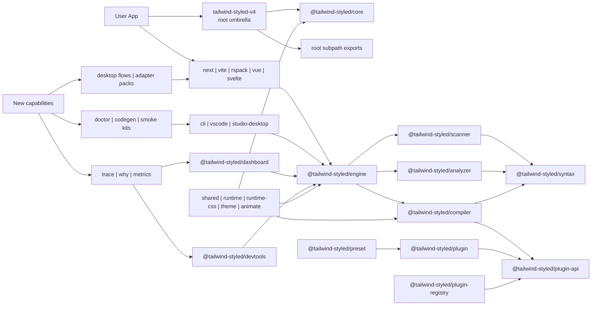
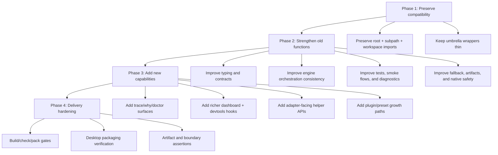
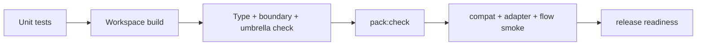

# Monorepo Restructure V2 via Mermaid

## Goal
- Keep all existing functionality and public imports working.
- Strengthen existing functionality so it becomes more stable, observable, and easier to maintain.
- Add new capabilities without forcing a breaking rewrite.
- Make the next restructure easier to discuss, review, and execute visually.

## Principles
- No feature removal.
- Root package `tailwind-styled-v4` stays as the umbrella public package.
- All `@tailwind-styled/*` workspace packages stay valid.
- Existing behavior should become safer, faster, better typed, and easier to debug.
- New capabilities must be additive, isolated, and testable.
- Every restructure step must improve either build clarity, plugin extensibility, tooling, or runtime insight.

## Target Architecture

## Preserve, Strengthen, and Expand Capability Map

```mermaid
flowchart TD
  A["Keep existing features"] --> A1["Root import compatibility"]
  A --> A2["Subpath export compatibility"]
  A --> A3["Workspace package compatibility"]
  A --> A4["CLI, VS Code, desktop stay usable"]

  B["Strengthen existing features"] --> B1["Better typing"]
  B --> B2["Better tests"]
  B --> B3["Better diagnostics"]
  B --> B4["Better performance"]
  B --> B5["Better fallback and packaging safety"]

  B1 --> B1A["Tighter public contracts"]
  B1 --> B1B["Fewer implicit any paths"]
  B2 --> B2A["Flow smoke coverage"]
  B2 --> B2B["Compatibility gates"]
  B3 --> B3A["trace / why / doctor"]
  B3 --> B3B["dashboard metrics"]
  B4 --> B4A["Less duplicate orchestration"]
  B4 --> B4B["Stronger engine facade"]
  B5 --> B5A["Safer native resolution"]
  B5 --> B5B["Safer pack artifacts"]

  C["Add new features"] --> C1["Engine facade APIs"]
  C --> C2["Plugin SDK hardening"]
  C --> C3["Workspace diagnostics"]
  C --> C4["Packaging validation"]
  C --> C5["Observability surfaces"]
  C --> C6["Feature-friendly release pipeline"]

  C1 --> D1["scanWorkspace"]
  C1 --> D2["analyzeWorkspace"]
  C1 --> D3["build"]
  C1 --> D4["generateSafelist"]

  C3 --> D5["doctor"]
  C3 --> D6["trace"]
  C3 --> D7["why"]

  C5 --> D8["dashboard metrics"]
  C5 --> D9["devtools traces"]
  C5 --> D10["desktop inspection"]
```

## Execution Streams

## Recommended V2 Changes
### 1. Preserve the compatibility shell
- Keep `tailwind-styled-v4` as the root umbrella package only.
- Keep root wrappers under `src/umbrella/`.
- Keep all existing public exports intact before adding anything new.

### 2. Strengthen old functions first
- Keep current runtime flows, but improve their contracts and reliability.
- Strengthen `scanner`, `analyzer`, `compiler`, and `engine` with tighter types and better smoke coverage.
- Strengthen old behavior with better fallback handling, diagnostics, and packaging safety instead of rewriting user-facing APIs.

### 3. Strengthen the engine as the orchestration layer
- Make `engine` the only package that adapters and tools need for workspace flows.
- Keep `scanner`, `analyzer`, and `compiler` as focused internals with stable entrypoints.
- Add additive facade methods instead of spreading orchestration logic into each adapter.

### 4. Expand tooling without widening coupling
- `dashboard` becomes the runtime metrics and health surface.
- `devtools` becomes the trace and inspection surface.
- `cli` gets additive commands such as `doctor`, `trace`, `why`, and optional `codegen`.
- `studio-desktop` becomes the offline operator UI, not a separate logic fork.

### 5. Expand plugin and preset ergonomics
- Keep `plugin` backward compatible as a wrapper over `plugin-api`.
- Add safer plugin manifest and transform registration patterns.
- Allow new preset packs without forcing compiler or adapter rewrites.

### 6. Harden build and release without reducing features
- Keep per-workspace `build`, `test`, `check`, and `pack:check`.
- Keep boundary rules strict so new features do not recreate old coupling.
- Keep publish artifacts minimal while preserving current runtime behavior.

## Strengthening Examples
- Keep root export behavior the same, but add compatibility assertions so regressions fail fast.
- Keep scanner/analyzer/compiler/engine flows the same, but tighten type contracts and remove weak implicit-any paths.
- Keep adapters usable as-is, but centralize more orchestration inside `engine` so behavior becomes more consistent.
- Keep CLI and tooling behavior intact, but add diagnostics like `doctor`, `trace`, and `why` on top of it.
- Keep packaging shape stable, but harden artifact checks so accidental `src/`, fixture manifests, or unsafe worker patterns do not leak.

## Suggested Feature Additions
- Workspace doctor mode for dependency, boundary, and artifact problems.
- Trace/why analysis output shared across CLI, dashboard, and desktop.
- Adapter smoke kits for `vite`, `next`, and `rspack`.
- Plugin starter templates and manifest validation.
- Feature-aware release pipeline for canary validation before umbrella publish.

## Acceptance Criteria
- Root import, subpath import, and direct workspace import still work.
- Existing user-facing functionality remains intact.
- Existing functionality becomes better typed, better tested, and easier to inspect.
- New capabilities are additive and optional.
- All workspace `build`, `check`, `test`, and `pack:check` gates remain green.
- Desktop packaging still succeeds.

## Test View

## Notes
- This V2 plan is now indexed by `plans/PLAN.md` as the approved additive direction.
- The point is to visualize the next restructure as an additive architecture step, not another disruptive migration.
