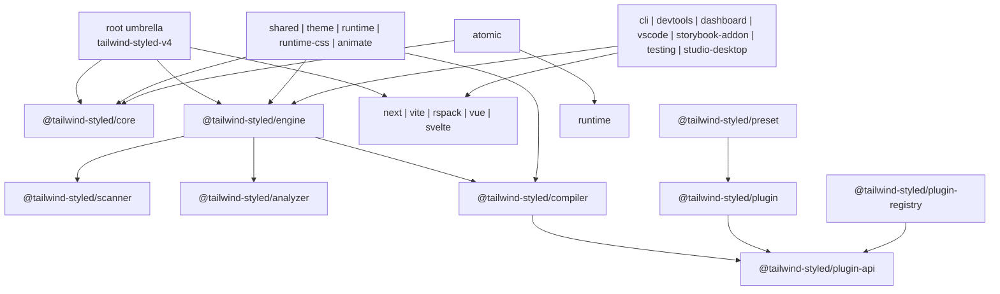
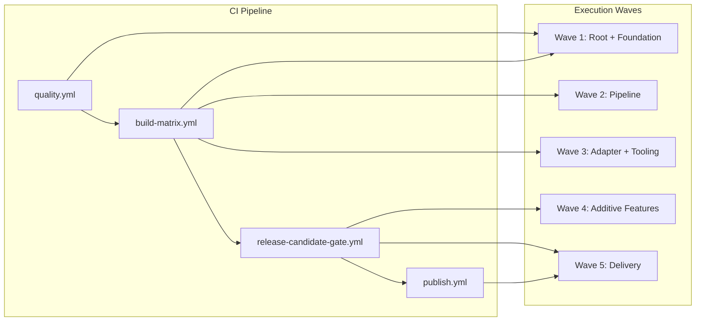
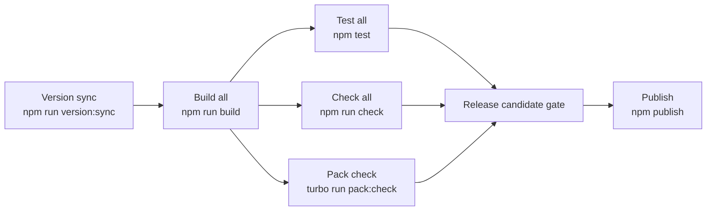
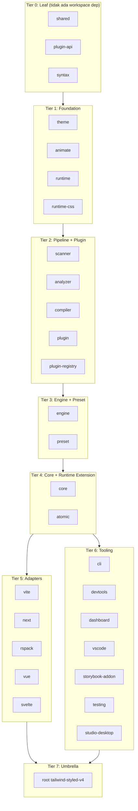
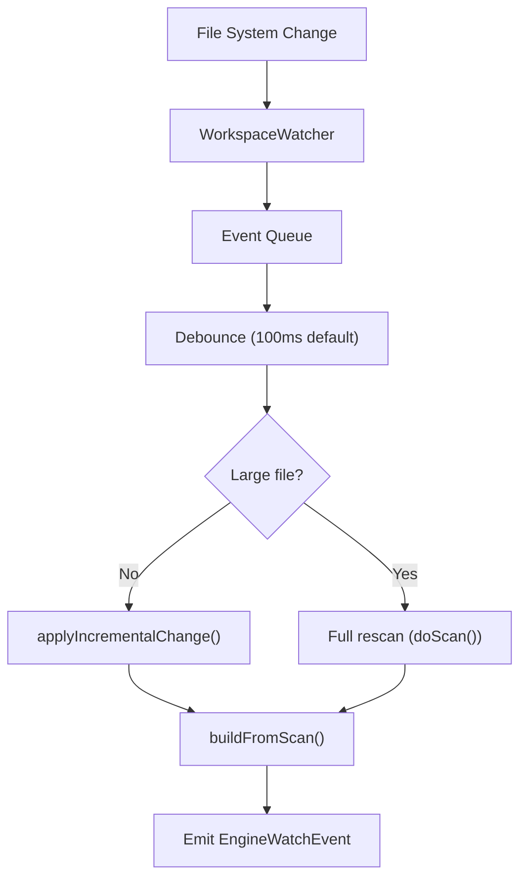
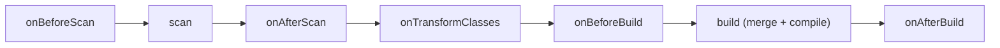
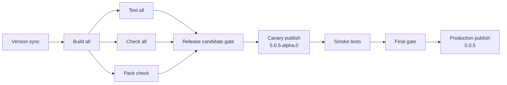
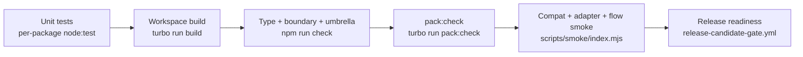

# Approved V2 Package Breakdown

Source of truth:
- [PLAN.md](c:/Users/User/Documents/demoPackageNpm/focus/tailwind-styled-v4.5-platform-modify-v3_fixed%20(1)/library/plans/PLAN.md)
- [monorepo-restructure-v2-mermaid.md](c:/Users/User/Documents/demoPackageNpm/focus/tailwind-styled-v4.5-platform-modify-v3_fixed%20(1)/library/plans/monorepo-restructure-v2-mermaid.md)
- [monorepo-restructure-v2-checklist.md](c:/Users/User/Documents/demoPackageNpm/focus/tailwind-styled-v4.5-platform-modify-v3_fixed%20(1)/library/plans/monorepo-restructure-v2-checklist.md)
- [monorepo-restructure-v2-execution-log.md](c:/Users/User/Documents/demoPackageNpm/focus/tailwind-styled-v4.5-platform-modify-v3_fixed%20(1)/library/plans/monorepo-restructure-v2-execution-log.md)

## Status
- `Approved`
- Purpose: mengubah direction V2 menjadi breakdown implementasi per package tanpa mengurangi fungsi, sambil memperkuat fungsi lama dan menambah fungsi baru.

## Package Responsibility Map


## Execution Waves
1. Wave 1: root compatibility shell dan foundation contracts.
2. Wave 2: pipeline hardening untuk `scanner -> analyzer -> compiler -> engine`.
3. Wave 3: adapter dan tooling hardening.
4. Wave 4: additive features untuk diagnostics, observability, plugin growth, dan desktop/operator surfaces.
5. Wave 5: delivery hardening untuk `build`, `check`, `test`, `pack:check`, dan release readiness.

## Package Breakdown
### Root Umbrella
`tailwind-styled-v4`
- Preserve:
  - Pertahankan root import dan seluruh subpath export.
  - Pertahankan `src/umbrella/` sebagai lapisan wrapper tipis.
- Strengthen:
  - Tambahkan compatibility smoke untuk root import dan root subpath import.
  - Pastikan build root hanya mengandalkan package entrypoint, bukan sibling `src`.
- Add:
  - Jadikan root sebagai entry resmi untuk release validation dan umbrella compatibility reporting.

### Foundation Layer
`core`
- Preserve:
  - Pertahankan kontrak styled component dan API yang sudah dipakai user.
- Strengthen:
  - Kencangkan typing `createComponent`, `extend`, `withVariants`, dan `animate`.
  - Tambahkan regression test untuk perilaku komposisi komponen.
- Add:
  - Siapkan surface contract yang lebih stabil untuk dipakai `atomic`, `runtime`, dan adapter.

`shared`
- Preserve:
  - Pertahankan util bersama yang dipakai lintas workspace.
- Strengthen:
  - Rapikan export yang terlalu longgar dan kurangi jalur type fallback.
  - Pastikan paket ini tidak menarik coupling ke layer yang lebih tinggi.
- Add:
  - Tambahkan helper umum yang benar-benar lintas layer dan reusable.

`theme`
- Preserve:
  - Pertahankan perilaku live token dan token bridge yang sudah ada.
- Strengthen:
  - Rapikan `liveTokenEngine` agar typed dan konsisten.
  - Tambahkan test untuk registry, update token, dan global engine bridge.
- Add:
  - Siapkan hook observability untuk perubahan token yang bisa dipakai tooling.

`runtime`
- Preserve:
  - Pertahankan runtime entry dan integrasi ke core/engine.
- Strengthen:
  - Tambahkan smoke test runtime import dan runtime flow.
  - Perjelas kontrak yang dipakai adapter dan extension package.
- Add:
  - Siapkan surface yang bisa dipakai untuk explain/trace runtime behavior.

`runtime-css`
- Preserve:
  - Pertahankan CSS runtime output yang sudah dipakai sekarang.
- Strengthen:
  - Tambahkan artifact assertion agar output publish tetap bersih dan aman.
  - Pastikan warning build tidak berubah jadi regression fungsional.
- Add:
  - Siapkan opsi output inspection untuk tooling.

`animate`
- Preserve:
  - Pertahankan behavior animasi yang sudah ada.
- Strengthen:
  - Tambahkan typing dan smoke test untuk integrasi ke `core`.
- Add:
  - Siapkan jalur ekspansi animation presets tanpa coupling ke adapter.

### Pipeline Layer
`syntax`
- Preserve:
  - Pertahankan peran sebagai helper sintaks lintas package.
- Strengthen:
  - Pastikan `scanner`, `analyzer`, dan `compiler` hanya bergantung pada surface sintaks yang stabil.
- Add:
  - Tambahkan helper parsing minimal yang benar-benar reusable lintas pipeline.

`scanner`
- Preserve:
  - Pertahankan perilaku scan dan cache yang sekarang dipakai pipeline.
- Strengthen:
  - Perketat type contract hasil scan.
  - Perkuat worker/bootstrap path dan artifact safety.
  - Tambahkan smoke test untuk cache dan workspace scanning.
- Add:
  - Siapkan metadata scan yang bisa dipakai `trace`, `why`, dan dashboard.

`analyzer`
- Preserve:
  - Pertahankan alur analisis hasil scan.
- Strengthen:
  - Perketat type contract input/output analyzer.
  - Tambahkan smoke test ESM/CJS compatibility bila relevan.
- Add:
  - Siapkan explainable analysis output untuk `why`.

`compiler`
- Preserve:
  - Pertahankan transform contract dan variant compilation yang sudah ada.
- Strengthen:
  - Selaraskan `astTransform` dengan shape `plugin-api` dan `CompiledVariants`.
  - Pastikan package ini tidak kembali coupling ke `plugin` wrapper.
  - Tambahkan smoke test compile path utama.
- Add:
  - Siapkan explain metadata untuk trace/debug transform.

`engine`
- Preserve:
  - Pertahankan engine sebagai orchestrator utama untuk tooling dan adapter.
- Strengthen:
  - Ganti type yang terlalu longgar di impact tracking dan workspace flow.
  - Tambahkan smoke test alur `scanner -> analyzer -> compiler -> engine`.
- Add:
  - Stabilkan facade `scanWorkspace`, `analyzeWorkspace`, `build`, dan `generateSafelist`.
  - Jadikan engine sumber utama untuk `doctor`, `trace`, dan `why`.

### Plugin and Preset Layer
`plugin-api`
- Preserve:
  - Pertahankan kontrak plugin yang sudah menjadi fondasi workspace lain.
- Strengthen:
  - Pastikan semua contract type stabil dan terisolasi dari wrapper runtime.
  - Tambahkan smoke test untuk registry dan transform/token registration.
- Add:
  - Tambahkan validasi manifest atau registration contract yang lebih aman.

`plugin`
- Preserve:
  - Pertahankan backward compatibility untuk user yang import dari `@tailwind-styled/plugin`.
- Strengthen:
  - Pastikan wrapper tetap tipis dan tidak menjadi sumber coupling baru.
- Add:
  - Tambahkan starter pattern untuk plugin baru di atas `plugin-api`.

`plugin-registry`
- Preserve:
  - Pertahankan registry behavior yang dipakai plugin ecosystem.
- Strengthen:
  - Rapikan kontrak ke `plugin-api` agar tidak ada duplikasi definisi.
- Add:
  - Tambahkan observability untuk registry resolution bila dibutuhkan tooling.

`preset`
- Preserve:
  - Pertahankan preset consumption yang sudah ada.
- Strengthen:
  - Tambahkan test untuk preset loading dan compatibility.
- Add:
  - Siapkan jalur ekspansi preset pack baru tanpa rewrite compiler.

### Adapter Layer
`vite`
- Preserve:
  - Pertahankan adapter behavior untuk integrasi Vite.
- Strengthen:
  - Selesaikan migrasi test ke `node:test`.
  - Tambahkan smoke test adapter dan import contract.
- Add:
  - Gunakan surface engine yang lebih konsisten untuk orchestration workspace.

`next`
- Preserve:
  - Pertahankan integrasi Next.js yang sekarang.
- Strengthen:
  - Tambahkan smoke test adapter config dan transform path.
  - Pastikan tidak ada import ke internal file workspace lain.
- Add:
  - Siapkan helper explainability yang bisa dipakai saat debugging integrasi.

`rspack`
- Preserve:
  - Pertahankan adapter behavior untuk Rspack.
- Strengthen:
  - Pastikan native binding optional tidak ikut ter-bundle secara salah.
  - Tambahkan smoke test adapter dan artifact assertion.
- Add:
  - Siapkan runtime/native diagnostics saat fallback aktif.

`vue`
- Preserve:
  - Pertahankan integrasi Vue.
- Strengthen:
  - Tambahkan smoke test untuk import dan build path minimal.
- Add:
  - Siapkan adapter hooks yang lebih konsisten ke engine.

`svelte`
- Preserve:
  - Pertahankan integrasi Svelte.
- Strengthen:
  - Tambahkan smoke test untuk import dan build path minimal.
- Add:
  - Siapkan adapter hooks yang lebih konsisten ke engine.

### Tooling and Operator Layer
`cli`
- Preserve:
  - Pertahankan command yang sudah ada.
- Strengthen:
  - Tambahkan smoke test command utama dan compatibility assertions.
- Add:
  - Tambahkan mode `doctor`, `trace`, `why`, dan helper `codegen` bila relevan.

`devtools`
- Preserve:
  - Pertahankan integrasi devtools yang sekarang.
- Strengthen:
  - Pastikan devtools membaca data dari surface engine yang stabil.
- Add:
  - Tambahkan trace/inspection panel yang lebih kaya.

`dashboard`
- Preserve:
  - Pertahankan dashboard sebagai surface monitoring yang ada.
- Strengthen:
  - Tambahkan metrik yang konsisten dengan output engine dan tooling.
- Add:
  - Tambahkan tampilan health, trace summary, dan package readiness.

`vscode`
- Preserve:
  - Pertahankan extension flow yang sudah berjalan.
- Strengthen:
  - Tambahkan compatibility check untuk import dan command wiring.
- Add:
  - Siapkan surface explainability yang reusable dari CLI/engine.

`storybook-addon`
- Preserve:
  - Pertahankan addon integration yang ada.
- Strengthen:
  - Tambahkan smoke test untuk addon entry dan packaging.
- Add:
  - Siapkan jalur observability ringan untuk story diagnostics.

`testing`
- Preserve:
  - Pertahankan helper testing yang sudah ada.
- Strengthen:
  - Pastikan helper test kompatibel dengan pipeline baru.
- Add:
  - Tambahkan reusable smoke kit untuk adapter dan compatibility checks.

`studio-desktop`
- Preserve:
  - Pertahankan desktop sebagai operator UI dan offline tool.
- Strengthen:
  - Pastikan `build` tetap berarti packaging dan hasil `electron-builder --dir` tetap lolos.
  - Tambahkan verifikasi asset/resource layout.
- Add:
  - Tambahkan inspection surface yang konsisten dengan `cli`, `dashboard`, dan `devtools`.

### Extension Layer
`atomic`
- Preserve:
  - Pertahankan primitive/component building blocks yang sudah ada.
- Strengthen:
  - Tambahkan smoke test integrasi ke `core` dan `runtime`.
- Add:
  - Siapkan jalur ekspansi component-level helpers tanpa menambah coupling ke adapter.

## Cross-Package Gates
- `scanner`, `analyzer`, `compiler`, dan `engine` adalah jalur kritis yang harus selalu diuji bersama.
- `vite`, `next`, dan `rspack` adalah adapter prioritas untuk smoke coverage.
- `plugin-api`, `plugin`, `plugin-registry`, dan `preset` harus bergerak tanpa memecah backward compatibility.
- `cli`, `devtools`, `dashboard`, dan `studio-desktop` harus berbagi surface diagnostics yang konsisten.

## Delivery Checklist by Wave
### Wave 1
- Root import compatibility.
- Subpath export compatibility.
- Workspace package import compatibility.
- Foundation contract cleanup.

### Wave 2
- Pipeline typing hardening.
- Full flow smoke `scanner -> analyzer -> compiler -> engine`.
- Artifact and worker/native safety.

### Wave 3
- Adapter smoke for `vite`, `next`, `rspack`, `vue`, dan `svelte`.
- Tooling compatibility checks.
- Desktop packaging verification.

### Wave 4
- `doctor`, `trace`, `why`.
- Dashboard metrics and devtools traces.
- Plugin starter and preset growth path.

### Wave 5
- `npm.cmd run build`
- `npm.cmd run check`
- `npm.cmd test`
- `npx.cmd turbo run pack:check --continue`

## Notes
- Breakdown ini tidak mengganti checklist; ia memetakan checklist ke package-package nyata.
- `packages/_experiments` tetap di luar discovery workspace dan tidak masuk scope publish.

---

## TypeScript + Zod Boundary Contracts

Kebijakan resmi: setiap package yang menerima data dari luar boundary-nya harus memvalidasi dengan Zod, lalu menggunakan `z.infer<typeof Schema>` sebagai tipe internal. TypeScript menangani kontrak kompilasi; Zod menangani validasi runtime di batas sistem.

### Boundary per Package
| Package | Boundary Input | Zod Schema Diperlukan | Catatan |
|---------|---------------|----------------------|---------|
| `engine` | Config workspace, scan result, CLI options | `WorkspaceConfigSchema`, `ScanResultSchema`, `EngineOptionsSchema` | Entry utama untuk adapter dan tooling |
| `scanner` | File paths, glob config, worker bootstrap args | `ScanOptionsSchema`, `WorkerBootstrapSchema` | Worker boundary harus divalidasi sebelum masuk domain logic |
| `analyzer` | Scan result input, analysis options | `AnalyzeInputSchema`, `AnalyzeOptionsSchema` | Input dari scanner harus sudah typed tapi tetap validasi di boundary analyzer |
| `compiler` | Transform options, plugin registration, AST input | `CompilerOptionsSchema`, `TransformInputSchema` | Plugin registration harus divalidasi sebelum masuk registry |
| `plugin-api` | Plugin manifest, transform registration, token registration | `PluginManifestSchema`, `TransformRegistrationSchema`, `TokenRegistrationSchema` | Kontrak publik; harus paling ketat |
| `cli` | CLI arguments, config file reads, environment variables | `CliArgsSchema`, `ConfigFileSchema`, `EnvSchema` | Entry point user-facing; harus fail-fast dengan pesan jelas |
| `next` | Next.js config options, adapter options | `NextAdapterOptionsSchema` | Bridge dari Next.js config ke engine |
| `vite` | Vite plugin options | `VitePluginOptionsSchema` | Bridge dari Vite config ke engine |
| `rspack` | Rspack plugin options, native binding results | `RspackPluginOptionsSchema`, `NativeBindingResultSchema` | Native binding response harus divalidasi sebelum masuk domain |
| `theme` | Token config, live token updates | `TokenConfigSchema`, `LiveTokenUpdateSchema` | Live token bridge harus validasi setiap update |
| `runtime` | Runtime config, adapter hooks | `RuntimeConfigSchema` | Runtime entry harus validasi sebelum masuk core/engine |
| `shared` | Tidak ada boundary eksternal langsung | Tidak perlu schema khusus | Internal utils; validasi dilakukan di package pemanggil |

### Aturan Penulisan Schema
- Nama schema harus eksplisit dan domain-oriented: `NativeReportSchema`, `AnalyzerOptionsSchema`, `PluginOptionsSchema`.
- Co-locate schema dengan package boundary yang dilindungi; lift ke `shared` jika dipakai lintas package.
- Error message harus human-readable agar membantu debugging, bukan hanya fail-fast.
- Setelah data tervalidasi di boundary, hot path internal boleh pakai plain typed object tanpa re-validasi berulang.

---

## ESM Migration Notes

Kebijakan resmi: `ESM-first`, dual `import`/`require` hanya di package yang masih punya consumer CJS nyata. Target jangka panjang: `full ESM-only`.

### Status per Package
| Package | Format Saat Ini | CJS Consumer Aktif? | Catatan ESM |
|---------|----------------|---------------------|-------------|
| `core` | ESM (`"type": "module"`) | Perlu audit | Root umbrella; dual export mungkin masih diperlukan |
| `engine` | ESM | Tidak | Internal; boleh ESM-only |
| `scanner` | ESM | Tidak | Internal; worker path harus ESM-safe |
| `analyzer` | ESM | Tidak | Internal; boleh ESM-only |
| `compiler` | ESM | Perlu audit | Dipakai adapter; perlu cek compatibility |
| `plugin-api` | ESM | Tidak | Internal contract; boleh ESM-only |
| `plugin` | ESM | Perlu audit | Public-facing; cek consumer CJS |
| `shared` | ESM | Tidak | Internal utils; boleh ESM-only |
| `theme` | ESM | Tidak | Internal; boleh ESM-only |
| `runtime` | ESM | Tidak | Internal; boleh ESM-only |
| `runtime-css` | ESM | Tidak | Internal; boleh ESM-only |
| `animate` | ESM | Tidak | Internal; boleh ESM-only |
| `syntax` | ESM | Tidak | Internal; boleh ESM-only |
| `cli` | ESM | Tidak | Binary; harus ESM-safe untuk `npx` |
| `next` | ESM | Perlu audit | Next.js adapter; cek loader compatibility |
| `vite` | ESM | Tidak | Vite sudah ESM-native |
| `rspack` | ESM | Tidak | Rspack adapter; native binding path harus ESM-safe |
| `vue` | ESM | Perlu audit | Vue adapter; cek compatibility |
| `svelte` | ESM | Perlu audit | Svelte adapter; cek compatibility |
| `dashboard` | ESM | Tidak | Internal tooling; boleh ESM-only |
| `devtools` | ESM | Tidak | Internal tooling; boleh ESM-only |
| `vscode` | ESM | Tidak | VS Code extension host mendukung ESM |
| `storybook-addon` | ESM | Perlu audit | Storybook config bisa bervariasi |
| `testing` | ESM | Tidak | Internal helper; boleh ESM-only |
| `studio-desktop` | ESM | Tidak | Electron; main process mungkin perlu CJS untuk beberapa path |
| `plugin-registry` | ESM | Tidak | Internal; boleh ESM-only |
| `preset` | ESM | Perlu audit | Public-facing; cek consumer |
| `atomic` | ESM | Tidak | Internal extension; boleh ESM-only |

### Guardrails
- Tidak ada package baru yang boleh dirancang `CJS-first`.
- Tidak ada API publik baru yang membutuhkan `require(...)` sebagai consumption path utama.
- Tidak ada build config yang bergantung pada fake global replacement `import.meta.url`.
- Tidak ada langkah migrasi yang menghapus fitur existing hanya untuk menyederhanakan keputusan format module.

### Auditor ESM Internal (Wave 1)
- Audit `analyzer`, `compiler`, `scanner`, `next`, `rspack`, dan `cli` untuk asumsi CJS-only di sekitar path, loader, native binding, dan worker/bootstrap resolution.
- Ganti sisa dirname/require fallback yang rapuh dengan shared ESM-safe runtime helper.
- Pastikan loader path resolution bekerja dari runtime location, bukan dari asumsi source-layout.

---

## Boundary Enforcement Rules

Gunakan `dependency-cruiser` untuk mencegah coupling lama muncul kembali. Rules harus di-enforce di CI dan bisa dijalankan lokal via `npm run check:boundaries`.

### Import Restrictions
| From | Forbidden Import To | Alasan |
|------|-------------------|--------|
| `scanner` | `compiler` | Scanner harus independen; tidak boleh bergantung pada compilation |
| `scanner` | `engine` | Scanner adalah leaf di pipeline; tidak boleh tarik orchestrator |
| `analyzer` | `compiler` | Analyzer bergantung pada scan result, bukan transform |
| `analyzer` | `engine` | Analyzer adalah internal pipeline; tidak boleh tarik orchestrator |
| `compiler` | `plugin` | Compiler harus bergantung pada `plugin-api`, bukan wrapper `plugin` |
| `compiler` | `engine` | Compiler adalah internal; tidak boleh tarik orchestrator |
| `plugin-api` | `plugin` | Kontrak harus independen dari wrapper |
| `plugin-api` | `engine` | Kontrak harus independen dari orchestrator |
| `syntax` | `scanner`, `analyzer`, `compiler`, `engine` | Syntax adalah helper paling dasar; tidak boleh bergantung pada pipeline |
| `shared` | Semua package di atas layer `shared` | Shared harus menjadi leaf; tidak boleh tarik layer lebih tinggi |
| Adapter (`vite`, `next`, `rspack`, `vue`, `svelte`) | Internal file package lain (`*/src/*`) | Adapter hanya boleh import melalui package entrypoint, bukan internal file |

### Allowed Import Directions
```
shared ← syntax ← scanner ← analyzer ← engine
shared ← syntax ← compiler ← engine
shared ← syntax ← compiler ← plugin-api ← plugin ← preset
shared ← core ← engine ← adapters (vite, next, rspack, vue, svelte)
shared ← core ← engine ← tools (cli, devtools, dashboard, vscode)
```

### Boundary Check Commands
```bash
# Cek semua boundary rules
npm run check:boundaries

# Cek specific rule
npx depcruise --config .dependency-cruiser.cjs packages/domain/scanner/src

# Cek ada cycle atau tidak
npx depcruise --config .dependency-cruiser.cjs packages/*/src --collapse 1
```

---

## Artifact Assertions

Setiap package yang dipublish harus memastikan artifact-nya bersih. Gunakan `npm pack --dry-run --json` untuk verifikasi.

### Artifact Rules per Package Type
| Package Type | Harus Ada | Tidak Boleh Ada |
|-------------|-----------|----------------|
| Semua package | `dist/`, `package.json`, `README.md`, `LICENSE` | `src/`, `test/`, `*.test.ts`, `*.spec.ts` |
| `scanner` | `dist/worker.js` (jika worker entry) | `index.minified.ts`, `eval: true` di bundle publish |
| `core` | `dist/` sesuai subpath exports | Source file langsung, nested `package.json` fixture |
| `theme` | `dist/` | `test/package.json` (harus rename ke `fixture.package.json`) |
| `engine` | `dist/` sesuai export (`.` dan `./internal`) | Source file, internal test fixtures |
| `studio-desktop` | `dist-electron/` | Source file, dev dependencies yang tidak diperlukan |
| `cli` | `dist/` | Source file, development-only scripts |

### Pack Check Commands
```bash
# Per-package dry run
cd packages/domain/engine && npm pack --dry-run --json

# Semua workspace via turbo
npx turbo run pack:check --continue

# Root umbrella
npm pack --dry-run --json
```

### Artifact Assertion yang Harus Ada di CI
- [x] Tidak ada `src/` di artifact publish.
- [x] Tidak ada `index.minified.ts` di scanner artifact.
- [x] Tidak ada `eval: true` di scanner bundle release.
- [x] Tidak ada nested fixture `package.json` di artifact.
- [x] Root umbrella artifact hanya berisi wrapper, bukan source langsung dari workspace lain.
- [x] `studio-desktop` `npm run build` menghasilkan `electron-builder --dir` output yang valid.

---

## Compatibility Testing Strategy

### Root Import Smoke
```typescript
// Test: root import tetap bekerja
import { tw } from 'tailwind-styled-v4'
import { createComponent } from 'tailwind-styled-v4'
// Harus resolve ke built package, bukan source
```

### Subpath Import Smoke
```typescript
// Test: subpath export tetap bekerja
import { ... } from 'tailwind-styled-v4/compiler'
import { ... } from 'tailwind-styled-v4/vite'
import { ... } from 'tailwind-styled-v4/next'
// Semua subpath yang sudah ada harus tetap accessible
```

### Direct Workspace Import Smoke
```typescript
// Test: direct package import tetap bekerja
import { ... } from '@tailwind-styled/engine'
import { ... } from '@tailwind-styled/scanner'
import { ... } from '@tailwind-styled/compiler'
// Semua @tailwind-styled/* harus tetap accessible
```

### Pipeline Flow Smoke
```typescript
// Test: scanner -> analyzer -> compiler -> engine full flow
// 1. Scanner menemukan class di source file
// 2. Analyzer memproses scan result
// 3. Compiler mentransform berdasarkan analysis
// 4. Engine mengorkestrasi seluruh flow
```

### Adapter Smoke
```typescript
// Test: setiap adapter bisa initialize dan run minimal flow
// vite: plugin creation dan transform hook
// next: config integration dan loader path
// rspack: plugin creation dan loader path
// vue: adapter initialization
// svelte: adapter initialization
```

---

## Validation Commands per Wave

### Wave 1: Root Compatibility & Foundation
```bash
npm run build                    # Pastikan root build bekerja
npm run check                    # Pastikan type check pass
npm test                         # Pastikan test pass
npx turbo run pack:check --continue  # Pastikan artifact bersih
# Manual: import dari root, subpath, dan @tailwind-styled/*
```

### Wave 2: Pipeline Hardening
```bash
npx turbo run build --filter=@tailwind-styled/syntax
npx turbo run build --filter=@tailwind-styled/scanner
npx turbo run build --filter=@tailwind-styled/analyzer
npx turbo run build --filter=@tailwind-styled/compiler
npx turbo run build --filter=@tailwind-styled/engine
npx turbo run test --filter=@tailwind-styled/engine
npm run check:boundaries         # Pastikan tidak ada cycle atau boundary violation
```

### Wave 3: Adapter & Tooling Hardening
```bash
npx turbo run build --filter=@tailwind-styled/vite
npx turbo run build --filter=@tailwind-styled/next
npx turbo run build --filter=@tailwind-styled/rspack
npx turbo run build --filter=@tailwind-styled/vue
npx turbo run build --filter=@tailwind-styled/svelte
npx turbo run build --filter=@tailwind-styled/cli
npx turbo run test --filter=@tailwind-styled/vite
npx turbo run test --filter=@tailwind-styled/next
# studio-desktop packaging
cd packages/infrastructure/studio-desktop && npm run build
```

### Wave 4: Additive Features
```bash
# doctor mode
npx @tailwind-styled/cli doctor

# trace mode
npx @tailwind-styled/cli trace --target <path>

# why mode
npx @tailwind-styled/cli why <class-name>

# dashboard metrics
npx turbo run build --filter=@tailwind-styled/dashboard
```

### Wave 5: Delivery Hardening
```bash
npm run build                    # Full workspace build
npm run check                    # Full type + boundary + umbrella check
npm test                         # Full test suite
npx turbo run pack:check --continue  # Semua package artifact check
npm pack --dry-run --json        # Root umbrella artifact check
```

---

## Known Issues & Risk Register

### Saat Ini Diketahui
| Issue | Package | Dampak | Mitigasi |
|-------|---------|--------|----------|
| `liveTokenEngine` belum fully typed | `theme` | Type error di downstream | Repair di Wave 2 |
| `astTransform` shape tidak match `CompiledVariants` | `compiler` | Compile error | Align di Wave 2 |
| `unknown` scan result di impact tracking | `engine` | Type safety risk | Replace dengan real type di Wave 2 |
| `createComponent` terlalu generik | `core` | Komposisi tidak typed | Kencangkan typing di Wave 2 |
| Rspack native binary ter-bundle salah | `rspack` | Build gagal di platform tertentu | Externalize native path di Wave 3 |
| Vitest belum migrasi ke `node:test` | `vite` | Test tidak konsisten | Convert di Wave 2-3 |
| `test/package.json` di theme | `theme` | Workspace discovery salah detect | Rename ke `fixture.package.json` |
| Placeholder `echo` tests | Beberapa package | Tidak ada real smoke coverage | Replace dengan real tests per wave |

### Risiko
| Risiko | Probabilitas | Dampak | Mitigasi |
|--------|-------------|--------|----------|
| Boundary rule terlalu ketat menghambat development | Medium | Low | Mulai dengan warn-only, enforce setelah stabil |
| ESM migration memecah consumer CJS | Low | High | Audit consumer sebelum drop CJS; keep dual sampai clear |
| Native binding di rspack tidak stabil | Medium | High | Pastikan fallback bekerja; test di multiple platform |
| Plugin ecosystem tidak kompatibel dengan plugin-api | Low | Medium | Keep `plugin` sebagai backward-compatible wrapper |
| Root umbrella terlalu besar setelah restructure | Low | Low | Monitor artifact size; split jika perlu |

---

## Dependency Graph per Layer

Dependency arah satu: layer bawah tidak boleh import layer atas. Visualisasi ini memperjelas aturan mana yang harus dijaga oleh `dependency-cruiser`.

```mermaid
flowchart BT
  subgraph Leaf["Leaf Layer (tidak punya dependency workspace)"]
    shared["@tailwind-styled/shared"]
    plugin_api["@tailwind-styled/plugin-api"]
  end

  subgraph Foundation["Foundation Layer"]
    syntax["@tailwind-styled/syntax"]
    theme["@tailwind-styled/theme"]
    animate["@tailwind-styled/animate"]
  end

  subgraph Pipeline["Pipeline Layer"]
    scanner["@tailwind-styled/scanner"]
    compiler["@tailwind-styled/compiler"]
    analyzer["@tailwind-styled/analyzer"]
  end

  subgraph Orchestration["Orchestration Layer"]
    engine["@tailwind-styled/engine"]
  end

  subgraph PluginLayer["Plugin & Preset Layer"]
    plugin["@tailwind-styled/plugin"]
    plugin_registry["@tailwind-styled/plugin-registry"]
    preset["@tailwind-styled/preset"]
  end

  subgraph RuntimeLayer["Runtime Layer"]
    runtime["@tailwind-styled/runtime"]
    runtime_css["@tailwind-styled/runtime-css"]
    atomic["@tailwind-styled/atomic"]
    core["@tailwind-styled/core"]
  end

  subgraph AdapterLayer["Adapter Layer"]
    vite["@tailwind-styled/vite"]
    next["@tailwind-styled/next"]
    rspack["@tailwind-styled/rspack"]
    vue["@tailwind-styled/vue"]
    svelte["@tailwind-styled/svelte"]
  end

  subgraph ToolingLayer["Tooling Layer"]
    cli["@tailwind-styled/cli"]
    devtools["@tailwind-styled/devtools"]
    dashboard["@tailwind-styled/dashboard"]
    vscode["@tailwind-styled/vscode"]
    storybook["@tailwind-styled/storybook-addon"]
    testing["@tailwind-styled/testing"]
    desktop["@tailwind-styled/studio-desktop"]
  end

  subgraph Umbrella["Umbrella"]
    root["tailwind-styled-v4 (root)"]
  end

  %% Leaf → Foundation
  shared --> syntax
  shared --> theme
  shared --> animate

  %% Foundation → Pipeline
  syntax --> scanner
  syntax --> compiler
  syntax --> analyzer

  %% Leaf → Pipeline langsung
  shared --> scanner
  shared --> analyzer
  shared --> compiler

  %% Pipeline → Orchestration
  scanner --> engine
  analyzer --> engine
  compiler --> engine

  %% Leaf → Plugin
  plugin_api --> plugin
  plugin_api --> plugin_registry
  plugin_api --> compiler

  %% Plugin → Preset
  plugin --> preset

  %% Foundation + Pipeline → Runtime
  shared --> runtime
  shared --> runtime_css
  shared --> atomic
  shared --> core

  compiler --> core
  plugin --> core
  preset --> core
  theme --> core
  animate --> core
  runtime --> core
  runtime_css --> core

  %% Orchestration → Adapter
  engine --> vite
  engine --> next
  engine --> rspack
  engine --> vue
  engine --> svelte

  %% Orchestration → Tooling
  engine --> cli
  engine --> devtools
  engine --> dashboard
  engine --> vscode

  %% Runtime → Extension
  core --> atomic
  runtime --> atomic

  %% Umbrella depends on everything
  core --> root
  vite --> root
  next --> root
  rspack --> root
  plugin --> root
  preset --> root
  theme --> root
  animate --> root
  runtime_css --> root
  devtools --> root
```



### Aturan Layer
| Layer | Boleh Import Dari | Tidak Boleh Import |
|-------|-------------------|-------------------|
| Leaf (`shared`, `plugin-api`) | Tidak ada dependency workspace | Semua package lain |
| Foundation (`syntax`, `theme`, `animate`) | Leaf | Pipeline, Engine, Adapter, Tooling |
| Pipeline (`scanner`, `compiler`, `analyzer`) | Leaf, Foundation | Engine, Adapter, Tooling, Plugin wrapper |
| Orchestration (`engine`) | Leaf, Foundation, Pipeline | Adapter, Tooling, Plugin wrapper |
| Plugin & Preset (`plugin`, `plugin-registry`, `preset`) | Leaf (`plugin-api`) | Engine, Adapter, Tooling |
| Runtime (`core`, `runtime`, `runtime-css`, `atomic`) | Leaf, Foundation, Pipeline, Plugin, Preset | Adapter, Tooling |
| Adapter (`vite`, `next`, `rspack`, `vue`, `svelte`) | Engine, Core | Internal file package lain |
| Tooling (`cli`, `devtools`, `dashboard`, `vscode`, `storybook-addon`, `testing`, `studio-desktop`) | Engine, Core | Internal file package lain |
| Umbrella (`root`) | Semua workspace package | Internal file package lain |

---

## Script Minimum per Workspace

Setiap workspace package harus memiliki script berikut agar pipeline Turbo berjalan konsisten.

### Script Wajib
| Script | Deskripsi | Dipakai Oleh |
|--------|-----------|-------------|
| `build` | Build package ke `dist/` | `turbo run build` |
| `build:dev` | Build dengan sourcemap + watch | Developer workflow |
| `build:release` | Build tanpa sourcemap untuk release | Release pipeline |
| `check` | Type check (`tsc --noEmit`) | `turbo run check`, `npm run check` |
| `clean` | Hapus `dist/` | Developer workflow |
| `dev` | Watch mode untuk development | Developer workflow |
| `test` | Jalankan test (prefer `node:test`) | `turbo run test`, `npm test` |
| `pack:check` | Verifikasi artifact publish | `turbo run pack:check` |

### Script Opsional
| Script | Deskripsi | Paket yang Membutuhkan |
|--------|-----------|----------------------|
| `test:watch` | Test dalam watch mode | `engine`, `scanner`, `shared` |
| `bench` | Benchmark | `engine`, `scanner` (jika ada) |

### Status Script Saat Ini
| Package | `build` | `check` | `test` | `pack:check` | Catatan |
|---------|---------|---------|--------|-------------|---------|
| `engine` | Ada | Ada | Ada (`node:test`) | Ada | Lengkap |
| `scanner` | Ada | Ada | Ada (`node:test`) | Ada | Lengkap |
| `analyzer` | Ada | Ada | Ada | Ada | Perlu cek test real vs placeholder |
| `compiler` | Ada | Ada | Ada | Ada | Perlu cek test real vs placeholder |
| `core` | Ada | Ada | Ada (`node:test`) | Ada | Lengkap |
| `shared` | Ada | Tidak ada | Ada (`node:test`) | Ada | Tambahkan `check` |
| `plugin-api` | Ada | Ada | Ada | Ada | Perlu cek test real vs placeholder |
| `plugin` | Ada | Ada | Ada | Ada | Perlu cek test real vs placeholder |
| `cli` | Ada | Ada | `echo "No tests yet"` | Ada | **Harus ganti dengan test real** |
| `theme` | Ada | Ada | Ada | Ada | Perlu cek test real vs placeholder |
| `runtime` | Ada | Ada | Ada | Ada | Perlu cek test real vs placeholder |
| `runtime-css` | Ada | Ada | Ada | Ada | Perlu cek test real vs placeholder |
| `animate` | Ada | Ada | Ada | Ada | Perlu cek test real vs placeholder |
| `syntax` | Ada | Ada | Ada | Ada | Perlu cek test real vs placeholder |
| `vite` | Ada | Ada | Vitest (belum node:test) | Ada | **Harus migrasi ke `node:test`** |
| `next` | Ada | Ada | Ada | Ada | Perlu cek test real vs placeholder |
| `rspack` | Ada | Ada | Ada | Ada | Perlu cek test real vs placeholder |
| `vue` | Ada | Ada | Ada | Ada | Perlu cek test real vs placeholder |
| `svelte` | Ada | Ada | Ada | Ada | Perlu cek test real vs placeholder |
| `dashboard` | Ada | Ada | Ada | Ada | Perlu cek test real vs placeholder |
| `devtools` | Ada | Ada | Ada | Ada | Perlu cek test real vs placeholder |
| `vscode` | Ada | Ada | Ada | Ada | Perlu cek test real vs placeholder |
| `storybook-addon` | Ada | Ada | Ada | Ada | Perlu cek test real vs placeholder |
| `testing` | Ada | Ada | Ada | Ada | Perlu cek test real vs placeholder |
| `studio-desktop` | Ada | Ada | Ada | Ada | `build` = Electron packaging |
| `plugin-registry` | Ada | Ada | Ada | Ada | Perlu cek test real vs placeholder |
| `preset` | Ada | Ada | Ada | Ada | Perlu cek test real vs placeholder |
| `atomic` | Ada | Ada | Ada | Ada | Perlu cek test real vs placeholder |

### Script yang Perlu Diperbaiki (Wave 1-2)
- `shared`: tambahkan script `check`
- `cli`: ganti `echo "No tests yet"` dengan test `node:test` real
- `vite`: migrasi dari Vitest ke `node:test`
- Semua package dengan placeholder test: ganti dengan smoke test minimal

---

## CI/CD Pipeline Integration

### Workflow yang Ada
Repo sudah memiliki 12 workflow GitHub Actions. Yang paling relevan dengan restructure:

| Workflow | Trigger | Fungsi |
|----------|---------|--------|
| `quality.yml` | Push/PR ke main | `build:rust` → `build` → `check` → `npm audit` |
| `build-matrix.yml` | Semua push/PR | Matrix {ubuntu, macos, windows} × {node 20, 22}: build → test → check |
| `release-candidate-gate.yml` | Manual dispatch | Full pipeline: build → test → check → smoke → benchmark |
| `publish.yml` | Release trigger | Publish package |
| `publish-alpha.yml` | Alpha trigger | Publish alpha version |
| `benchmark.yml` | Benchmark trigger | Run benchmark |
| `dependencies.yml` | Dependency trigger | Dependency management |
| `plugin-registry-test.yml` | Plugin trigger | Plugin registry test |
| `rust-parser-regression.yml` | Rust trigger | Rust parser regression |
| `compat-matrix.yml` | Compat trigger | Compatibility matrix |

### Mapping CI ke Wave


### CI Gate per Wave
| Wave | CI Gate | Command |
|------|---------|---------|
| Wave 1 | `quality.yml` | `npm run build` + `npm run check` |
| Wave 2 | `build-matrix.yml` | `turbo run build test check` |
| Wave 3 | `build-matrix.yml` | `turbo run build test check` (adapter + tooling) |
| Wave 4 | `release-candidate-gate.yml` | Full pipeline + smoke + benchmark |
| Wave 5 | `release-candidate-gate.yml` | Full pipeline + `pack:check` |

### CI yang Harus Ditambahkan
- [x] Boundary check step di `quality.yml` (sudah ada via `npm run check` yang include `check:boundaries`)
- [x] `pack:check` step di `release-candidate-gate.yml`
- [x] Umbrella compatibility smoke di `build-matrix.yml`
- [x] Artifact size gate (fail jika root umbrella > threshold tertentu)

---

## Strategi Versioning

### Kebijakan Versi Saat Ini
- Semua package workspace di versi `5.0.4` (seragam).
- Root umbrella `tailwind-styled-v4` juga di versi `5.0.4`.
- Dependency antar workspace menggunakan `^5.0.4` (semver range).
- Tidak ada `workspace:*` di package yang dipublish.

### Versioning Model
| Tipe Package | Versioning | Contoh |
|-------------|-----------|--------|
| Public (root umbrella) | Semver manual, synced | `tailwind-styled-v4@5.0.4` |
| Public (`@tailwind-styled/*`) | Semver manual, synced | `@tailwind-styled/core@5.0.4` |
| Private (`testing`, `studio-desktop`) | Semver manual, synced | `@tailwind-styled/testing@5.0.4` |
| Internal (`plugin-api`, `syntax`) | Semver manual, synced | `@tailwind-styled/plugin-api@5.0.4` |

### Version Sync Script
```bash
# Sync semua package ke versi yang sama
npm run version:sync

# Script ini menjalankan: node scripts/version-sync.mjs
```

### Aturan Dependency Antar Workspace
| Dependency Type | Kapan Dipakai | Contoh |
|----------------|--------------|--------|
| `^5.0.4` (semver range) | Package yang dipublish | `@tailwind-styled/scanner` → `@tailwind-styled/shared: ^5.0.4` |
| `workspace:*` | Hanya private/non-published | Jika ada package internal yang tidak dipublish |
| `file:../` | **Tidak boleh** | - |
| `link:../` | **Tidak boleh** | - |

### Release Flow


### Canary Release
- Untuk test sebelum publish resmi, gunakan versi prerelease: `5.0.5-alpha.0`.
- `publish-alpha.yml` workflow sudah ada untuk ini.
- Setiap canary harus lolos `release-candidate-gate.yml` sebelum publish.

---

## `_experiments` Scope Definition

### Status
- `packages/_experiments` adalah direktori untuk eksperimen dan prototyping.
- **Tidak punya `package.json`** — bukan workspace package formal.
- Tidak masuk dalam `workspaces: ["packages/*"]` discovery (underscore prefix diabaikan oleh npm).
- Tidak masuk scope `turbo`, `tsup`, atau publish graph.

### Isi Saat Ini
```
packages/_experiments/
  └── scanner/
      └── (eksperimen scanner, termasuk index.minified.ts yang dipindahkan dari packages/domain/scanner)
```

### Aturan
| Rule | Deskripsi |
|------|-----------|
| Tidak masuk build | Tidak ada `tsup`, `tsc`, atau build step yang mengenai `_experiments` |
| Tidak masuk test | Tidak ada test runner yang mengenai `_experiments` |
| Tidak masuk publish | Tidak ada artifact publish dari `_experiments` |
| Tidak masuk boundary check | `dependency-cruiser` mengabaikan `_experiments` |
| Tidak masuk type check | `tsc --noEmit` tidak mengenai `_experiments` |
| Boleh dihapus kapan saja | Isi `_experiments` bisa dihapus tanpa mempengaruhi workspace |

### Kapan Pakai `_experiments`
- Migrasi file yang sebelumnya ada di package produksi tapi belum siap dihapus (contoh: `index.minified.ts` dari scanner).
- Prototyping fitur baru sebelum masuk package resmi.
- Benchmark atau stress test yang tidak cocok untuk test suite utama.

### Kapan Tidak Pakai `_experiments`
- Jika kode sudah stabil dan punya consumer — masukkan ke package resmi.
- Jika kode sudah tidak dipakai — hapus langsung, jangan simpan di `_experiments`.
- Jika kode butuh build/test — masukkan ke package resmi dengan test yang proper.

---

## Ringkasan Eksekusi

### Paket per Wave (Urutan Eksekusi)

```mermaid
flowchart TD
  subgraph W1["Wave 1: Root + Foundation"]
    W1A["root umbrella"]
    W1B["shared"]
    W1C["syntax"]
    W1D["theme"]
    W1E["animate"]
    W1F["plugin-api"]
    W1G["runtime"]
    W1H["runtime-css"]
  end

  subgraph W2["Wave 2: Pipeline"]
    W2A["scanner"]
    W2B["analyzer"]
    W2C["compiler"]
    W2D["engine"]
  end

  subgraph W3["Wave 3: Adapter + Tooling"]
    W3A["plugin"]
    W3B["plugin-registry"]
    W3C["preset"]
    W3D["core"]
    W3E["vite"]
    W3F["next"]
    W3G["rspack"]
    W3H["vue"]
    W3I["svelte"]
    W3J["cli"]
    W3K["devtools"]
    W3L["dashboard"]
    W3M["vscode"]
    W3N["storybook-addon"]
    W3O["testing"]
    W3P["atomic"]
    W3Q["studio-desktop"]
  end

  subgraph W4["Wave 4: Additive Features"]
    W4A["doctor mode"]
    W4B["trace mode"]
    W4C["why mode"]
    W4D["dashboard metrics"]
    W4E["devtools traces"]
    W4F["plugin starter"]
  end

  subgraph W5["Wave 5: Delivery"]
    W5A["Full build"]
    W5B["Full check"]
    W5C["Full test"]
    W5D["Full pack:check"]
    W5E["Release candidate gate"]
  end

  W1 --> W2
  W2 --> W3
  W3 --> W4
  W4 --> W5
```



### Checklist Ringkas per Wave
- [x] **Wave 1**: Root import compatibility, foundation contract cleanup, smoke test root/subpath/workspace import
- [x] **Wave 2**: Pipeline typing hardening, `scanner→analyzer→compiler→engine` full flow smoke, artifact safety
- [x] **Wave 3**: Adapter smoke (vite, next, rspack, vue, svelte), tooling compatibility, desktop packaging
- [x] **Wave 4**: `doctor`, `trace`, `why`, dan dashboard metrics sudah masuk production prototype; devtools traces dan plugin starter masih pending
- [x] **Wave 5**: Full `build`, `check`, `test`, `pack:check`, release candidate gate

---

## TSconfig Path Strategy

Repo saat ini menggunakan `tsconfig.base.json` dengan `baseUrl: "."` tanpa `paths`. Ini artinya cross-workspace import mengandalkan `node_modules` resolution (via npm workspaces symlink), bukan TypeScript path mapping.

### Masalah Saat Ini
- Umbrella root dan workspace package bisa jadi mengandalkan source-path resolution saat dev, sehingga `tsc` di workspace package resolve ke source sibling, bukan ke built package artifact.
- Ini bisa menyebabkan `dts` generation menarik source dari package lain, bukan dari `dist/` yang sudah di-build.

### Strategi Pemisahan
| Konteks | Resolution Target | Config |
|---------|------------------|--------|
| Dev (IDE, watch) | Source sibling via workspace symlink | `tsconfig.base.json` (current) |
| Build (tsup, DTS) | Built package via `dist/` entrypoint | Package-level `tsconfig.build.json` |
| CI typecheck | Source sibling (validasi contract) | `tsconfig.base.json` (current) |

### Aturan
- **Tidak ada `paths` mapping** di `tsconfig.base.json` untuk `@tailwind-styled/*`. Biarkan npm workspace symlink yang handle resolution.
- Setiap workspace package yang perlu DTS generation harus memastikan import ke sibling package resolve ke **built artifact**, bukan source. Ini dicapai oleh urutan build turbo (`^build`), bukan oleh path mapping.
- Jika ada package yang gagal DTS karena resolve ke source sibling, fix di level dependency order, bukan dengan fake path mapping.

### Verifikasi
```bash
# Pastikan tidak ada paths di tsconfig.base.json
cat tsconfig.base.json | grep -c "paths"  # harus 0

# Pastikan build order benar
npx turbo build --dry  # cek dependency graph

# Pastikan DTS tidak menarik source
ls packages/domain/engine/dist/index.d.ts  # harus resolve dari dist, bukan src
```

---

## Workspace Build Fix Order

Urutan fix berdasarkan PLAN.md "Execute to Green All Workspaces". Fix harus dilakukan dalam dependency order agar tidak ada cascade failure.

### Urutan Fix
| Urutan | Package | Issue | Fix Detail | Wave |
|--------|---------|-------|------------|------|
| 1 | `shared` | Missing `check` script | Tambahkan `"check": "tsc --noEmit -p tsconfig.json"` | 1 |
| 2 | `theme` | `liveTokenEngine` belum fully typed | Repair `liveTokenEngine` agar pakai satu typed token store, match `LiveTokenSet`/`LiveTokenEngineBridge`, register global engine tanpa untyped globals | 2 |
| 3 | `compiler` | `astTransform` shape tidak match `CompiledVariants` | Align `astTransform` dengan `CompiledVariants` dan plugin-api context shapes; pastikan `plugin-api` sebagai satu-satunya plugin contract dependency | 2 |
| 4 | `engine` | `unknown` scan result di impact tracking | Replace dengan real scan result type dari `scanner` | 2 |
| 5 | `core` | `createComponent` terlalu generik | Type `createComponent` agar `extend`, `withVariants`, `animate` attach via declared styled-component contract | 2 |
| 6 | `rspack` | Native binary ter-bundle salah | Externalize atau runtime-resolve native package path supaya tsup tidak include `.node` files | 3 |
| 7 | `studio-desktop` | Electron packaging belum lengkap | Tambah missing metadata untuk electron-builder, verifikasi asset/resource layout | 3 |
| 8 | `vite` | Vitest belum migrasi ke `node:test` | Convert test dari Vitest ke `node:test`, wire package `test` script | 2-3 |
| 9 | `cli` | `echo "No tests yet"` placeholder | Ganti dengan real `node:test` smoke test | 2 |
| 10 | Multiple | Placeholder `echo` tests | Replace dengan real smoke coverage: `compiler`, `scanner`, `analyzer`, `engine`, `runtime`, `next`, `vite`, `rspack`, `plugin`, `plugin-api` | 2-3 |

### Prinsip Fix
- Fix dalam dependency order: leaf → foundation → pipeline → engine → adapter → tooling.
- Setiap fix harus tetap hijau di `build`, `check`, `test`, dan `pack:check`.
- Tidak ada fix yang menghapus fitur existing.
- Fix yang mengubah public contract harus tambahkan backward compatibility wrapper.

---

## dependency-cruiser Gap Analysis

### Rules yang Sudah Ada (di `dependency-cruiser.cjs`)
| Rule | From | To | Status |
|------|------|-----|--------|
| `scanner-no-compiler-source` | `scanner/src` | `compiler/src` | **Enforced** |
| `compiler-no-plugin-implementation-source` | `compiler/src` | `plugin/src` | **Enforced** |
| `adapter-no-internal-imports` | `vite/next/rspack/src` | Other package `src/` (non-index) | **Enforced** |

### Rules yang Masih Kurang (dari Boundary Enforcement Rules di dokumen ini)
| Rule | From | To | Alasan | Status |
|------|------|-----|--------|--------|
| `scanner-no-engine` | `scanner` | `engine` | Scanner adalah leaf; tidak boleh tarik orchestrator | **Belum ada** |
| `analyzer-no-compiler` | `analyzer` | `compiler` | Analyzer bergantung scan result, bukan transform | **Belum ada** |
| `analyzer-no-engine` | `analyzer` | `engine` | Analyzer adalah internal pipeline | **Belum ada** |
| `compiler-no-engine` | `compiler` | `engine` | Compiler adalah internal; tidak boleh tarik orchestrator | **Belum ada** |
| `plugin-api-no-plugin` | `plugin-api` | `plugin` | Kontrak harus independen dari wrapper | **Belum ada** |
| `plugin-api-no-engine` | `plugin-api` | `engine` | Kontrak harus independen dari orchestrator | **Belum ada** |
| `syntax-no-pipeline` | `syntax` | `scanner/analyzer/compiler/engine` | Syntax adalah helper paling dasar | **Belum ada** |
| `shared-no-upper-layer` | `shared` | Semua package di atas `shared` | Shared harus menjadi leaf | **Belum ada** |
| `vue-no-internal-imports` | `vue/src` | Other package `src/` (non-index) | Adapter rule belum cover vue | **Belum ada** (adapter rule hanya cover vite/next/rspack) |
| `svelte-no-internal-imports` | `svelte/src` | Other package `src/` (non-index) | Adapter rule belum cover svelte | **Belum ada** (adapter rule hanya cover vite/next/rspack) |

### Rules yang Perlu Di-update
| Rule | Update |
|------|--------|
| `adapter-no-internal-imports` | Extend `from` path dari `^packages/(vite\|next\|rspack)/src` menjadi `^packages/(vite\|next\|rspack\|vue\|svelte)/src` |

### Rekomendasi `dependency-cruiser.cjs` Update
```js
// Tambahan rules yang harus ditambahkan ke forbidden array:
{
  name: "scanner-no-engine",
  severity: "error",
  from: { path: "^packages/domain/scanner/src" },
  to: { path: "^packages/domain/engine/src" }
},
{
  name: "analyzer-no-compiler-or-engine",
  severity: "error",
  from: { path: "^packages/domain/analyzer/src" },
  to: { path: "^packages/(compiler|engine)/src" }
},
{
  name: "compiler-no-engine",
  severity: "error",
  from: { path: "^packages/domain/compiler/src" },
  to: { path: "^packages/domain/engine/src" }
},
{
  name: "plugin-api-no-plugin-or-engine",
  severity: "error",
  from: { path: "^packages/domain/plugin-api/src" },
  to: { path: "^packages/(plugin|engine)/src" }
},
{
  name: "syntax-no-pipeline",
  severity: "error",
  from: { path: "^packages/domain/syntax/src" },
  to: { path: "^packages/(scanner|analyzer|compiler|engine)/src" }
},
{
  name: "shared-no-upper-layer",
  severity: "error",
  from: { path: "^packages/domain/shared/src" },
  to: {
    path: "^packages/(?!shared)[^/]+/src",
    dependencyTypesNot: ["npm"]
  }
},
{
  name: "adapter-no-internal-imports",  // UPDATE: extend to vue + svelte
  severity: "error",
  from: { path: "^packages/(vite|next|rspack|vue|svelte)/src" },
  to: {
    path: "^packages/(?!vite|next|rspack|vue|svelte)[^/]+/src/(?!index\\.ts$)",
    dependencyTypesNot: ["npm"]
  }
}
```

---

## Turbo Build Dependency Graph

Turbo `^build` pattern berarti setiap package di-build setelah dependency-nya di-build. Graph ini ditentukan oleh `dependencies` di masing-masing `package.json`.

### Urutan Build (Berdasarkan Dependency)


### Mapping ke Actual Dependencies
| Package | Workspace Dependencies | Tier |
|---------|----------------------|------|
| `shared` | (none) | 0 |
| `plugin-api` | (none) | 0 |
| `syntax` | `shared` | 0-1 |
| `theme` | `shared` | 1 |
| `animate` | `shared` | 1 |
| `runtime` | `shared` | 1 |
| `runtime-css` | `shared` | 1 |
| `scanner` | `shared`, `syntax` | 2 |
| `analyzer` | `shared`, `syntax` | 2 |
| `compiler` | `shared`, `syntax`, `plugin-api` | 2 |
| `plugin` | `plugin-api` | 2 |
| `plugin-registry` | `plugin-api` | 2 |
| `engine` | `shared`, `scanner`, `analyzer`, `compiler` | 3 |
| `preset` | `plugin` | 3 |
| `core` | `animate`, `compiler`, `devtools`, `next`, `plugin`, `preset`, `runtime-css`, `theme`, `vite` | 4 |
| `atomic` | `core`, `runtime` | 4 |
| `vite` | `engine` | 5 |
| `next` | `engine` | 5 |
| `rspack` | `engine` | 5 |
| `vue` | `engine` | 5 |
| `svelte` | `engine` | 5 |
| `cli` | `engine` | 6 |
| `devtools` | `engine` | 6 |
| `dashboard` | `engine` | 6 |
| `vscode` | `engine` | 6 |
| `storybook-addon` | `engine` | 6 |
| `testing` | `engine` | 6 |
| `studio-desktop` | `engine` | 6 |
| `root` | Semua workspace | 7 |

---

## Smoke Test Implementation Guide

### Root Import Smoke
```mjs
// scripts/smoke/root-import.mjs
import { tw } from 'tailwind-styled-v4'
import { createComponent } from 'tailwind-styled-v4'

if (typeof tw !== 'function') throw new Error('root import: tw is not a function')
if (typeof createComponent !== 'function') throw new Error('root import: createComponent is not a function')
console.log('root import smoke OK')
```

### Subpath Import Smoke
```mjs
// scripts/smoke/subpath-import.mjs
const subpaths = [
  'tailwind-styled-v4/compiler',
  'tailwind-styled-v4/vite',
  'tailwind-styled-v4/next',
  'tailwind-styled-v4/engine',
  'tailwind-styled-v4/scanner',
  'tailwind-styled-v4/theme',
  'tailwind-styled-v4/preset',
  'tailwind-styled-v4/cli',
  'tailwind-styled-v4/analyzer',
  'tailwind-styled-v4/shared',
  'tailwind-styled-v4/runtime',
  'tailwind-styled-v4/runtime-css',
  'tailwind-styled-v4/plugin',
  'tailwind-styled-v4/plugin-registry',
  'tailwind-styled-v4/animate',
  'tailwind-styled-v4/rspack',
  'tailwind-styled-v4/vue',
  'tailwind-styled-v4/svelte',
  'tailwind-styled-v4/testing',
  'tailwind-styled-v4/storybook-addon',
  'tailwind-styled-v4/devtools',
  'tailwind-styled-v4/atomic',
  'tailwind-styled-v4/dashboard',
]

for (const subpath of subpaths) {
  try {
    await import(subpath)
    console.log(`subpath import OK: ${subpath}`)
  } catch (e) {
    console.error(`subpath import FAIL: ${subpath} - ${e.message}`)
    process.exit(1)
  }
}
console.log('all subpath imports OK')
```

### Direct Workspace Import Smoke
```mjs
// scripts/smoke/workspace-import.mjs
const packages = [
  '@tailwind-styled/engine',
  '@tailwind-styled/scanner',
  '@tailwind-styled/compiler',
  '@tailwind-styled/analyzer',
  '@tailwind-styled/core',
  '@tailwind-styled/shared',
  '@tailwind-styled/theme',
  '@tailwind-styled/plugin',
  '@tailwind-styled/plugin-registry',
  '@tailwind-styled/preset',
  '@tailwind-styled/vite',
  '@tailwind-styled/next',
  '@tailwind-styled/rspack',
  '@tailwind-styled/vue',
  '@tailwind-styled/svelte',
  '@tailwind-styled/runtime',
  '@tailwind-styled/runtime-css',
  '@tailwind-styled/animate',
  '@tailwind-styled/syntax',
]

for (const pkg of packages) {
  try {
    await import(pkg)
    console.log(`workspace import OK: ${pkg}`)
  } catch (e) {
    console.error(`workspace import FAIL: ${pkg} - ${e.message}`)
    process.exit(1)
  }
}
console.log('all workspace imports OK')
```

### Pipeline Flow Smoke
```mjs
// scripts/smoke/pipeline-flow.mjs
import { scanWorkspace } from '@tailwind-styled/scanner'
import { analyzeWorkspace } from '@tailwind-styled/analyzer'
import { compile } from '@tailwind-styled/compiler'
import { build } from '@tailwind-styled/engine'

// 1. Scan
const scanResult = await scanWorkspace({ cwd: process.cwd() })
if (!scanResult || !scanResult.classes) throw new Error('pipeline: scan failed')

// 2. Analyze
const analysis = await analyzeWorkspace(scanResult)
if (!analysis) throw new Error('pipeline: analyze failed')

// 3. Compile
const compiled = await compile(analysis)
if (!compiled) throw new Error('pipeline: compile failed')

// 4. Engine full flow
const engineResult = await build({ cwd: process.cwd() })
if (!engineResult) throw new Error('pipeline: engine build failed')

console.log('pipeline flow smoke OK')
```

### Adapter Smoke
```mjs
// scripts/smoke/adapter-vite.mjs
import { tailwindStyledVite } from '@tailwind-styled/vite'
const plugin = tailwindStyledVite()
if (!plugin || !plugin.name) throw new Error('vite adapter: plugin creation failed')
console.log('vite adapter smoke OK')

// scripts/smoke/adapter-next.mjs
import { withTailwindStyled } from '@tailwind-styled/next'
if (typeof withTailwindStyled !== 'function') throw new Error('next adapter: config helper missing')
console.log('next adapter smoke OK')

// scripts/smoke/adapter-rspack.mjs
import { tailwindStyledRspack } from '@tailwind-styled/rspack'
if (typeof tailwindStyledRspack !== 'function') throw new Error('rspack adapter: plugin creation failed')
console.log('rspack adapter smoke OK')
```

---

## Workspace Package Audit Matrix

Status aktual per package berdasarkan inspeksi `package.json` dan repo state.

### Status Script
| Package | `build` | `check` | `test` | `pack:check` | `clean` | `dev` | Issue |
|---------|---------|---------|--------|-------------|---------|-------|-------|
| `shared` | Ada | **TIDAK ADA** | Ada | Ada | Ada | Ada | **Wave 1: tambahkan `check`** |
| `engine` | Ada | Ada | Ada | Ada | Ada | Ada | Lengkap |
| `scanner` | Ada | Ada | Ada | Ada | Ada | Ada | Lengkap |
| `analyzer` | Ada | Ada | Ada | Ada | Ada | Ada | Perlu verifikasi test real vs placeholder |
| `compiler` | Ada | Ada | Ada | Ada | Ada | Ada | Perlu verifikasi test real vs placeholder |
| `core` | Ada | Ada | Ada | Ada | Ada | Ada | Lengkap |
| `plugin-api` | Ada | Ada | Ada | Ada | Ada | Ada | Perlu verifikasi test real vs placeholder |
| `plugin` | Ada | Ada | Ada | Ada | Ada | Ada | Perlu verifikasi test real vs placeholder |
| `plugin-registry` | Ada | Ada | Ada | Ada | Ada | Ada | Perlu verifikasi test real vs placeholder |
| `preset` | Ada | Ada | Ada | Ada | Ada | Ada | Perlu verifikasi test real vs placeholder |
| `cli` | Ada | Ada | **`echo "No tests yet"`** | Ada | Ada | Ada | **Wave 2: ganti dengan node:test** |
| `theme` | Ada | Ada | Ada | Ada | Ada | Ada | Cek `test/package.json` → `fixture.package.json` |
| `runtime` | Ada | Ada | Ada | Ada | Ada | Ada | Perlu verifikasi test real vs placeholder |
| `runtime-css` | Ada | Ada | Ada | Ada | Ada | Ada | Perlu verifikasi test real vs placeholder |
| `animate` | Ada | Ada | Ada | Ada | Ada | Ada | Perlu verifikasi test real vs placeholder |
| `syntax` | Ada | Ada | Ada | Ada | Ada | Ada | Perlu verifikasi test real vs placeholder |
| `vite` | Ada | Ada | **Vitest (belum node:test)** | Ada | Ada | Ada | **Wave 2-3: migrasi ke node:test** |
| `next` | Ada | Ada | Ada | Ada | Ada | Ada | Perlu verifikasi test real vs placeholder |
| `rspack` | Ada | Ada | Ada | Ada | Ada | Ada | Perlu verifikasi native binding safety |
| `vue` | Ada | Ada | Ada | Ada | Ada | Ada | Perlu verifikasi test real vs placeholder |
| `svelte` | Ada | Ada | Ada | Ada | Ada | Ada | Perlu verifikasi test real vs placeholder |
| `dashboard` | Ada | Ada | Ada | Ada | Ada | Ada | Perlu verifikasi test real vs placeholder |
| `devtools` | Ada | Ada | Ada | Ada | Ada | Ada | Perlu verifikasi test real vs placeholder |
| `vscode` | Ada | Ada | Ada | Ada | Ada | Ada | Perlu verifikasi test real vs placeholder |
| `storybook-addon` | Ada | Ada | Ada | Ada | Ada | Ada | Perlu verifikasi test real vs placeholder |
| `testing` | Ada | Ada | Ada | Ada | Ada | Ada | Perlu verifikasi test real vs placeholder |
| `studio-desktop` | Ada | Ada | Ada | Ada | Ada | Ada | `build` = Electron packaging |
| `atomic` | Ada | Ada | Ada | Ada | Ada | Ada | Perlu verifikasi test real vs placeholder |

### Format Package
| Package | `"type": "module"` | Dual Export (CJS+ESM) | Target |
|---------|--------------------|-----------------------|--------|
| `shared` | Ya | Ya (`index.js` + `index.cjs`) | ESM-only (internal) |
| `engine` | Ya | Ya | ESM-only (internal) |
| `scanner` | Ya | Ya | ESM-only (internal) |
| `analyzer` | Ya | Ya | ESM-only (internal) |
| `compiler` | Ya | Ya | Audit CJS consumer |
| `core` | Ya | Ya | Keep dual (public) |
| `plugin-api` | Ya | Ya | ESM-only (internal) |
| `plugin` | Ya | Ya | Audit CJS consumer |
| `cli` | Ya | ESM-only | ESM-only (binary) |
| `theme` | Ya | Ya | ESM-only (internal) |
| `runtime` | Ya | Ya | ESM-only (internal) |
| `runtime-css` | Ya | Ya | ESM-only (internal) |
| `animate` | Ya | Ya | ESM-only (internal) |
| `syntax` | Ya | Ya | ESM-only (internal) |
| `vite` | Ya | Ya | ESM-only (Vite native ESM) |
| `next` | Ya | Ya | Audit loader compatibility |
| `rspack` | Ya | Ya | ESM-only (Rspack native ESM) |
| `vue` | Ya | Ya | Audit consumer |
| `svelte` | Ya | Ya | Audit consumer |
| `dashboard` | Ya | Ya | ESM-only (internal) |
| `devtools` | Ya | Ya | ESM-only (internal) |
| `vscode` | Ya | Ya | ESM-only (VS Code host supports ESM) |
| `storybook-addon` | Ya | Ya | Audit Storybook config |
| `testing` | Ya | Ya | ESM-only (internal) |
| `studio-desktop` | Ya | Ya | Electron main process may need CJS |
| `plugin-registry` | Ya | Ya | ESM-only (internal) |
| `preset` | Ya | Ya | Audit CJS consumer |
| `atomic` | Ya | Ya | ESM-only (internal) |

### Priority Fix Queue (Wave 1-2)
1. `shared`: tambahkan `check` script
2. `cli`: ganti `echo "No tests yet"` dengan `node:test` smoke
3. `vite`: migrasi Vitest → `node:test`
4. `theme`: rename `test/package.json` → `fixture.package.json`
5. `scanner`: pastikan `eval: true` sudah tidak ada di dist bundle
6. `engine`: replace `unknown` scan result type
7. `compiler`: align `astTransform` shape
8. `core`: tighten `createComponent` typing

---

## Umbrella Wrapper Contract

Root umbrella `tailwind-styled-v4` menggunakan `src/umbrella/` sebagai lapisan wrapper tipis yang re-export dari workspace package.

### Struktur
```
src/umbrella/
  index.ts          → re-export dari @tailwind-styled/core
  compiler.ts       → re-export dari @tailwind-styled/compiler
  vite.ts           → re-export dari @tailwind-styled/vite
  next.ts           → re-export dari @tailwind-styled/next
  engine.ts         → re-export dari @tailwind-styled/engine
  scanner.ts        → re-export dari @tailwind-styled/scanner
  theme.ts          → re-export dari @tailwind-styled/theme
  preset.ts         → re-export dari @tailwind-styled/preset
  cli.ts            → re-export dari create-tailwind-styled (cli)
  analyzer.ts       → re-export dari @tailwind-styled/analyzer
  shared.ts         → re-export dari @tailwind-styled/shared
  runtime.ts        → re-export dari @tailwind-styled/runtime
  runtime-css.ts    → re-export dari @tailwind-styled/runtime-css
  plugin.ts         → re-export dari @tailwind-styled/plugin
  plugin-registry.ts→ re-export dari @tailwind-styled/plugin-registry
  next.ts           → re-export dari @tailwind-styled/next
  vite.ts           → re-export dari @tailwind-styled/vite
  rspack.ts         → re-export dari @tailwind-styled/rspack
  vue.ts            → re-export dari @tailwind-styled/vue
  svelte.ts         → re-export dari @tailwind-styled/svelte
  testing.ts        → re-export dari @tailwind-styled/testing
  storybook-addon.ts→ re-export dari @tailwind-styled/storybook-addon
  devtools.ts       → re-export dari @tailwind-styled/devtools
  atomic.ts         → re-export dari @tailwind-styled/atomic
  dashboard.ts      → re-export dari @tailwind-styled/dashboard
  animate.ts        → re-export dari @tailwind-styled/animate
```

### Verifikasi
```bash
# check-umbrella-exports.mjs memastikan:
# 1. Setiap export key di root package.json punya wrapper file di src/umbrella/
# 2. Setiap export key di packages/domain/core/package.json punya source file
node scripts/check-umbrella-exports.mjs
```

### Aturan
- Wrapper harus **tipis**: hanya `export ... from '@tailwind-styled/...'`, tidak ada logic.
- Root `tsup` build hanya build wrapper entries, bukan source dari workspace lain.
- Tidak ada import dari `packages/*/src` di root wrapper; semua harus dari package entrypoint.

---

## Gate Command Reference

### Per-Wave Commands
| Wave | Command | Tujuan |
|------|---------|--------|
| 1 | `npm run build` | Pastikan root + workspace build |
| 1 | `npm run check` | Type + boundary + umbrella check |
| 1 | `npm test` | Full test suite |
| 1 | `npx turbo run pack:check --continue` | Artifact verification |
| 2 | `npx depcruise --config dependency-cruiser.cjs packages` | Boundary enforcement |
| 2 | `node scripts/check-umbrella-exports.mjs` | Umbrella export integrity |
| 2 | `node scripts/smoke/pipeline-flow.mjs` | Pipeline full flow |
| 3 | `node scripts/smoke/adapter-vite.mjs` | Vite adapter smoke |
| 3 | `node scripts/smoke/adapter-next.mjs` | Next adapter smoke |
| 3 | `node scripts/smoke/adapter-rspack.mjs` | Rspack adapter smoke |
| 4 | `npx @tailwind-styled/cli doctor` | Doctor mode |
| 4 | `npx @tailwind-styled/cli trace --target <path>` | Trace mode |
| 4 | `npx @tailwind-styled/cli why <class>` | Why mode |
| 5 | `npm run build && npm run check && npm test && npx turbo run pack:check --continue` | Full delivery gate |
| 5 | `node scripts/smoke/index.mjs` | Smoke tests (release gate) |
| 5 | `npm pack --dry-run --json` | Root umbrella artifact check |

---

## Zod Schema Implementation Guide

Kebijakan: `TypeScript` untuk compile-time contract, `Zod` untuk runtime validation di system boundary. Setelah validasi di boundary, hot path pakai plain typed object tanpa re-validasi.

### Template Schema File

```typescript
// packages/<nama>/src/schema.ts
import { z } from "zod"

// Nama eksplisit dan domain-oriented
export const ScanOptionsSchema = z.object({
  rootDir: z.string().min(1, "rootDir tidak boleh kosong"),
  include: z.array(z.string()).default(["**/*.{tsx,jsx,ts,js}"]),
  exclude: z.array(z.string()).default(["node_modules/**"]),
  workerCount: z.number().int().min(1).max(16).optional(),
})

// Derive type dari schema — single source of truth
export type ScanOptions = z.infer<typeof ScanOptionsSchema>

// Validasi di boundary
export function validateScanOptions(input: unknown): ScanOptions {
  return ScanOptionsSchema.parse(input)
}
```

### Pola Boundary Validation

```typescript
// packages/<nama>/src/index.ts
import { validateScanOptions, type ScanOptions } from "./schema"

// Boundary: terima unknown, validasi dengan Zod
export function scanWorkspace(rawOptions: unknown): ScanResult {
  const options: ScanOptions = validateScanOptions(rawOptions)

  // Setelah validasi, pakai plain typed object di hot path
  return doScan(options) // options sudah typed dan trusted
}
```

### Schema per Package

| Package | File | Schema | Boundary Input |
|---------|------|--------|---------------|
| `engine` | `packages/domain/engine/src/schema.ts` | `WorkspaceConfigSchema`, `ScanResultSchema`, `EngineOptionsSchema`, `BuildOptionsSchema`, `SafelistOptionsSchema` | Config workspace, scan result, CLI options |
| `scanner` | `packages/domain/scanner/src/schema.ts` | `ScanOptionsSchema`, `WorkerBootstrapSchema`, `FileScanResultSchema` | File paths, glob config, worker bootstrap args |
| `analyzer` | `packages/domain/analyzer/src/schema.ts` | `AnalyzeInputSchema`, `AnalyzeOptionsSchema`, `AnalysisResultSchema` | Scan result input, analysis options |
| `compiler` | `packages/domain/compiler/src/schema.ts` | `CompilerOptionsSchema`, `TransformInputSchema`, `CompiledVariantsSchema` | Transform options, plugin registration, AST input |
| `plugin-api` | `packages/domain/plugin-api/src/schema.ts` | `PluginManifestSchema`, `TransformRegistrationSchema`, `TokenRegistrationSchema`, `PluginContextSchema` | Plugin manifest, transform/token registration |
| `cli` | `packages/infrastructure/cli/src/schema.ts` | `CliArgsSchema`, `ConfigFileSchema`, `EnvSchema` | CLI arguments, config file reads, env vars |
| `next` | `packages/presentation/next/src/schema.ts` | `NextAdapterOptionsSchema` | Next.js config options |
| `vite` | `packages/presentation/vite/src/schema.ts` | `VitePluginOptionsSchema` | Vite plugin options |
| `rspack` | `packages/presentation/rspack/src/schema.ts` | `RspackPluginOptionsSchema`, `NativeBindingResultSchema` | Rspack plugin options, native binding results |
| `theme` | `packages/domain/theme/src/schema.ts` | `TokenConfigSchema`, `LiveTokenUpdateSchema` | Token config, live token updates |
| `runtime` | `packages/domain/runtime/src/schema.ts` | `RuntimeConfigSchema` | Runtime config, adapter hooks |

### Urutan Implementasi
1. **Wave 1**: `plugin-api` (kontrak publik paling ketat, tidak punya dependency workspace)
2. **Wave 2**: `scanner`, `analyzer`, `compiler`, `engine` (pipeline boundary)
3. **Wave 3**: `cli`, `next`, `vite`, `rspack`, `theme`, `runtime` (adapter dan runtime boundary)

### Guardrails
- Tidak boleh re-validate di hot path setelah boundary validasi
- Error message harus human-readable: `"rootDir tidak boleh kosong"`, bukan `"Required"`
- Co-locate schema dengan package yang dilindungi; lift ke `shared` hanya jika dipakai lintas package
- Gunakan `.default()` untuk optional field agar consumer tidak perlu specify semua field
- `shared` tidak perlu schema khusus (tidak punya boundary eksternal langsung; validasi dilakukan di package pemanggil)

---

## Vitest → node:test Migration Plan (`vite`)

### Status
- `packages/presentation/vite/src/vite.test.ts` masih menggunakan Vitest
- Semua test lain di repo sudah pakai `node:test` + `node:assert/strict`
- Harus migrasi agar konsisten dan agar `vitest` bisa dihapus dari dependency

### Langkah Migrasi
1. Baca `packages/presentation/vite/src/vite.test.ts` — pahami setiap test case
2. Buat `packages/presentation/vite/test/vite.test.mjs` dengan pola `node:test`
3. Konversi setiap assertion:
   | Vitest | node:test |
   |--------|-----------|
   | `describe` / `it` | `describe` / `test` dari `node:test` |
   | `expect(x).toBe(y)` | `assert.equal(x, y)` dari `node:assert/strict` |
   | `expect(x).toEqual(y)` | `assert.deepEqual(x, y)` |
   | `expect(x).toMatch(y)` | `assert.match(x, y)` |
   | `expect(x).toThrow()` | `assert.throws(() => x)` |
   | `expect(x).rejects.toThrow()` | `assert.rejects(async () => x, /regex/)` |
   | `vi.fn()` | Manual callback atau `test.mock.fn()` (node >= 22) |
   | `vi.mock()` | `test.mock.module()` (node >= 22) atau refactor test |
4. Update `packages/presentation/vite/package.json`:
   ```diff
   - "test": "vitest run"
   + "test": "node --test test/*.test.mjs"
   ```
5. Hapus `vitest` dari `devDependencies`
6. Verifikasi: `npx turbo run test --filter=@tailwind-styled/vite`

### Guardrails
- Tidak boleh hilangkan test case selama migrasi; setiap Vitest test harus punya padanan
- Jika test butuh Vitest-specific feature (misal `vi.mock`), refactor agar test tidak bergantung pada mock atau pakai `test.mock.module()` (node:test >= 22)
- Test harus tetap berjalan di CI `build-matrix.yml` (ubuntu, macos, windows × node 20, 22)
- Hapus file lama `packages/presentation/vite/src/vite.test.ts` setelah migrasi berhasil

### Estimasi Dampak
- 1 file test (`vite.test.ts`)
- ~5-15 test case (tergantung kompleksitas)
- Tidak ada package lain yang bergantung pada Vitest di repo ini

---

## Studio-Desktop Packaging Fix

### Status
- `studio-desktop` adalah Electron app, bukan npm package biasa
- `build` script = Electron packaging (`electron-builder`)
- Saat ini kemungkinan gagal karena metadata kurang dan dep opsional

### Fix yang Diperlukan

1. **Metadata** — Tambahkan field wajib di `packages/infrastructure/studio-desktop/package.json`:
   ```json
   {
     "name": "@tailwind-styled/studio-desktop",
     "version": "5.0.4",
     "description": "Tailwind Styled Studio Desktop",
     "author": "tailwind-styled",
     "license": "MIT",
     "main": "dist-electron/main.js"
   }
   ```

2. **Dependencies** — Jadikan Electron deps mandatory (bukan devDependencies) untuk build:
   ```json
   {
     "dependencies": {
       "electron": "^...",
       "electron-builder": "^..."
     }
   }
   ```

3. **Asset/Layout** — Verifikasi struktur yang dibutuhkan electron-builder:
   ```
   packages/infrastructure/studio-desktop/
     ├── package.json          ← metadata lengkap
     ├── dist-electron/        ← build output
     │   ├── main.js
     │   └── preload.js
     ├── resources/            ← icon, tray, dll
     └── electron-builder.yml  ← config (jika ada)
   ```

4. **Gate**:
   ```bash
   cd packages/infrastructure/studio-desktop && npm run build
   # Harus menghasilkan dist-electron/ dengan output yang valid
   ```

### CI Integration
- Tambahkan step di `build-matrix.yml` untuk studio-desktop packaging verification
- Gunakan `ubuntu-latest` untuk packaging test (tidak perlu windows/macos untuk `--dir` mode)
- Verifikasi: `ls packages/infrastructure/studio-desktop/dist-electron/` harus ada output setelah build

---

## Engine Facade Contract

Engine adalah orchestration layer utama yang dipakai oleh semua adapter dan tooling. Kontrak facade-nya harus stabil dan typed.

### Public API (`@tailwind-styled/engine`)

```typescript
// packages/domain/engine/src/index.ts

export interface EngineOptions {
  root?: string
  scanner?: ScanWorkspaceOptions
  compileCss?: boolean
  tailwindConfigPath?: string
  plugins?: EnginePlugin[]
  /** Enable analyzer integration - provides semantic report (unused classes, conflicts). Default: false */
  analyze?: boolean
}

export interface EngineWatchOptions {
  debounceMs?: number
  maxEventsPerFlush?: number
  largeFileThreshold?: number
}

export interface BuildResult {
  scan: ScanWorkspaceResult
  mergedClassList: string
  css: string
  analysis?: {
    unusedClasses: string[]
    classConflicts: Array<{ className: string; files: string[]; classes?: string[]; message?: string }>
    classUsage: Record<string, number>
    semantic?: AnalyzerSemanticReport
    report: AnalyzerReport
  }
}

export type EngineWatchEvent =
  | { type: "initial" | "change" | "unlink" | "full-rescan"; filePath?: string; result: BuildResult; metrics?: EngineMetricsSnapshot }
  | { type: "error"; filePath?: string; error: string; metrics?: EngineMetricsSnapshot }

export interface TailwindStyledEngine {
  scan(): Promise<ScanWorkspaceResult>
  scanWorkspace(): Promise<ScanWorkspaceResult>
  analyzeWorkspace(): Promise<Awaited<ReturnType<typeof runWorkspaceAnalysis>>>
  generateSafelist(): Promise<string[]>
  build(): Promise<BuildResult>
  watch(onEvent: (event: EngineWatchEvent) => void, options?: EngineWatchOptions): Promise<{ close(): void }>
}

export async function createEngine(options?: EngineOptions): Promise<TailwindStyledEngine>
```

### Internal API (`@tailwind-styled/engine/internal`)

```typescript
// packages/domain/engine/src/internal.ts

// Bundle analysis
export { BundleAnalyzer, type BundleAnalysisResult, type ClassBundleInfo } from "./bundleAnalyzer"

// Impact tracking
export { ImpactTracker, type ImpactReport, type ComponentImpact } from "./impactTracker"

// Reverse lookup (CSS → class mapping)
export { ReverseLookup, type ReverseLookupResult, type ClassUsage } from "./reverseLookup"

// Incremental build
export { applyIncrementalChange } from "./incremental"

// Metrics
export type { EngineMetricsSnapshot } from "./metrics"
export { EngineMetricsCollector } from "./metrics"

// Plugin API
export { type EnginePlugin, type EnginePluginContext, type EngineWatchContext,
  runAfterBuild, runAfterScan, runAfterWatch,
  runBeforeBuild, runBeforeScan, runBeforeWatch,
  runOnError, runTransformClasses } from "./plugin-api"

// Watch
export type { WorkspaceWatcher } from "./watch"
export { watchWorkspace as watchWorkspaceLegacy } from "./watch"
export type { WatchCallback, WatchEvent, WatchEventKind, WatchHandle } from "./watch-native"
export { watchWorkspace as watchWorkspaceNative } from "./watch-native"

// IR types
export { RuleId, SelectorId, VariantChainId, PropertyId, ValueId,
  LayerId, ConditionId, CascadeResolutionId, Origin, Importance, ConditionResult, CascadeStage,
  type ResolutionCause, type ResolutionReason, type SelectorIR, type VariantChainIR,
  type ConditionIR, type RuleIR, type PropertyBucketIR, type CascadeResolutionIR,
  type StyleGraphIR, type FinalComputedStyleIR, type SourceLocation,
  createFingerprint, compareCascadeOrder, createResolutionReason } from "./ir"

// Re-export scanner types
export type { ScanWorkspaceResult, ScanFileResult, ScanWorkspaceOptions } from "@tailwind-styled/scanner"
```

### Aturan Kontrak Engine
| Aturan | Detail |
|--------|--------|
| `TailwindStyledEngine` interface stabil | Tidak boleh berubah tanpa major version |
| `BuildResult` shape stabil | Adapter bergantung pada `scan`, `mergedClassList`, `css`, `analysis` |
| `EngineOptions` additive | Field baru harus optional dengan default yang backward-compatible |
| `createEngine()` stable | Signature tidak boleh berubah |
| `internal` subpath volatile | Boleh berubah tanpa notice; hanya untuk internal tooling |
| `EnginePlugin` interface stable | Plugin ecosystem bergantung pada ini |

### Adapter Consumption Pattern
```typescript
// Semua adapter mengikuti pola ini:
import { createEngine } from "@tailwind-styled/engine"

const engine = await createEngine({ root: projectRoot, plugins: [...] })
const result = await engine.build()
// result.css → output CSS
// result.scan.uniqueClasses → daftar class yang dipakai
// result.analysis → (jika analyze: true) semantic report
```

---

## IR Type System

IR (Intermediate Representation) adalah core data model engine. Digunakan oleh `BundleAnalyzer`, `ImpactTracker`, `ReverseLookup`, `cssToIr`, dan `trace`.

### ID Types
```typescript
// packages/domain/engine/src/ir.ts

export class RuleId { constructor(public readonly value: number) {} }
export class SelectorId { constructor(public readonly value: number) {} }
export class VariantChainId { constructor(public readonly value: number) {} }
export class PropertyId { name?: string; constructor(public readonly value: number) {} }
export class ValueId { name?: string; constructor(public readonly value: number) {} }
export class LayerId { constructor(public readonly value: number) {} }
export class ConditionId { constructor(public readonly value: number) {} }
export class CascadeResolutionId { constructor(public readonly value: number) {} }
```

### Core IR Types
```typescript
export enum Origin { User = "user", Preflight = "preflight", Plugin = "plugin" }
export enum Importance { Normal = 0, Important = 1 }
export enum ConditionResult { Match = "match", NoMatch = "no-match", Unknown = "unknown" }

export interface SourceLocation { file: string; line: number; column: number }
export interface SelectorIR { id: SelectorId; className: string; variants: string[] }
export interface VariantChainIR { id: VariantChainId; selectors: SelectorIR[] }
export interface ConditionIR { id: ConditionId; query: string; result: ConditionResult }
export interface RuleIR { id: RuleId; selector: SelectorIR; property: PropertyId; value: ValueId; origin: Origin; importance: Importance; source: SourceLocation }
export interface PropertyBucketIR { property: PropertyId; rules: RuleIR[] }
export interface CascadeResolutionIR { property: PropertyId; winner: RuleIR | null; cause: ResolutionCause }
export interface StyleGraphIR { rules: RuleIR[]; buckets: PropertyBucketIR[]; resolutions: CascadeResolutionIR[] }
export interface FinalComputedStyleIR { selector: SelectorIR; properties: Map<PropertyId, string> }
```

### Aturan IR
- ID types menggunakan class wrapper, bukan plain number, untuk type safety.
- `PropertyId` dan `ValueId` punya optional `name` field yang di-set oleh `traceService` untuk display.
- IR tidak boleh import dari adapter atau tooling layer.
- `SourceLocation` dipakai lintas engine internal untuk trace/debug.

---

## Zero Let / Zero Any Audit Status

Berdasarkan audit di `plans/zero-everything.md`.

### Zero Let Status
| File | Sisa `let` | Status |
|------|-----------|--------|
| `cli/src/createApp.ts:394` | `let count = 0` | **Perlu fix** — ganti dengan `.reduce()` atau immutable pattern |
| `compiler/src/componentHoister.ts:79` | Comment only (sudah pakai reduce) | **OK** |
| `compiler/src/styleBucketSystem.ts:255` | Comment only (sudah pakai reduce) | **OK** |
| `engine/src/bundleAnalyzer.ts:253` | Comment only (sudah pakai matchAll) | **OK** |
| `engine/src/cssToIr.ts:149,166` | Comment only (sudah pakai matchAll) | **OK** |
| `engine/src/reverseLookup.ts:51,79` | Comment only (sudah pakai matchAll) | **OK** |
| `svelte/src/index.ts:25,26` | Comment/docstring only (`export let`) | **OK** — Svelte syntax, bukan JS let |

### Zero Any Status — Hotspot per Package
| Package | `any` Count (approx) | Hotspot Files | Prioritas |
|---------|---------------------|---------------|-----------|
| `cli` | ~30+ | `traceService.ts` (paling banyak), `createApp.ts` | **Tinggi** — user-facing |
| `compiler` | ~25+ | `astParser.ts`, `astTransform.ts`, `tailwindEngine.ts`, `variantCompiler.ts` | **Tinggi** — pipeline core |
| `core` | ~20+ | `createComponent.ts`, `twProxy.ts`, `liveTokenEngine.ts` | **Tinggi** — public API |
| `plugin` | ~15+ | `index.ts` (transforms, config, context) | **Tinggi** — public API |
| `devtools` | ~15+ | `index.tsx` (window globals) | **Medium** — internal tooling |
| `engine` | ~5 | `impactTracker.ts` (scanResult: any), `ir.ts` (as any), `cssToIr.ts` | **Medium** — pipeline core |
| `next` | ~10 | `withTailwindStyled.ts` (webpack config, nextConfig as any) | **Medium** — adapter |
| `vite` | ~3 | `plugin.ts` (configResolved, handleHotUpdate) | **Low** — adapter |
| `rspack` | ~2 | `index.ts` (apply, existing) | **Low** — adapter |
| `vue` | ~8 | `index.ts` (props, compounds, install) | **Medium** — adapter |
| `svelte` | ~7 | `index.ts` (props, compounds) | **Medium** — adapter |
| `theme` | ~3 | `index.ts`, `liveTokenEngine.ts` (window globals) | **Low** |
| `shared` | ~4 | `timing.ts` (debounce/throttle generics) | **Low** — utility |
| `storybook-addon` | ~1 | `index.ts` (compoundVariants) | **Low** |

### Strategi Pengurangan `any`
| Wave | Target | Approach |
|------|--------|----------|
| 2 | `engine/impactTracker.ts` | Replace `scanResult: any` dengan `ImpactScanResult` type |
| 2 | `compiler/astParser.ts` | Tambahkan OXC node types; replace `any` dengan proper AST types |
| 2 | `core/createComponent.ts` | Tighten `createComponent` generic; replace `Record<string, any>` dengan proper props type |
| 2 | `cli/traceService.ts` | Replace `Map<PropertyId, any>` dengan typed map; replace `engineResult.*.map((v: any) => ...)` dengan engine result types |
| 3 | `plugin/index.ts` | Replace `Record<string, any>` config dengan typed config schema |
| 3 | `next/withTailwindStyled.ts` | Replace `nextConfig as any` dengan Next.js config type |
| 3 | `vue/index.ts`, `svelte/index.ts` | Replace `Record<string, any>` props dengan framework-specific types |
| 4 | `devtools/index.tsx` | Replace `(window as any).__TW_*__` dengan typed global registry |

### Aturan Zero Any
- Tidak ada `any` di public API surface (export types, function signatures).
- `as any` hanya boleh di test files dan `tsup.config.ts`.
- `Record<string, any>` harus diganti dengan typed schema atau `Record<string, unknown>`.
- `(window as any)` harus diganti dengan typed global declaration.

---

## Native Binding Safety

Engine dan scanner menggunakan Rust native binding untuk performance-critical operations. Binding ini optional — harus ada fallback behavior yang jelas.

### Native Bridge Architecture
```
packages/domain/engine/src/native-bridge.ts
  ├── getNativeEngineBinding() → NativeEngineBinding | throws
  ├── _binding (cached state)
  ├── _loadError (error state)
  └── _candidatePaths (search paths)

packages/domain/scanner/src/native-bridge.ts
  └── (similar pattern untuk scanner)

packages/domain/shared/src/nativeBinding.ts
  └── (shared native binding utilities)
```

### Native Engine Binding Interface
```typescript
interface NativeEngineBinding {
  computeIncrementalDiff?(previousJson: string, currentJson: string): {
    addedClasses: string[]
    removedClasses: string[]
    changedFiles: string[]
    unchangedFiles: number
  } | null
  hashFileContent?(content: string): string | null
  processFileChange?(filepath: string, newClasses: string[], content: string | null): {
    added: string[]
    removed: string[]
  } | null
}
```

### Candidate Paths
```typescript
// Engine native-bridge.ts
_candidatePaths.set([
  path.resolve(process.cwd(), "native", "tailwind_styled_parser.node"),
  path.resolve(runtimeDir, "..", "..", "..", "native", "tailwind_styled_parser.node"),
])
```

### Aturan Native Binding
| Aturan | Detail |
|--------|--------|
| Native binding **REQUIRED** di engine | `getNativeEngineBinding()` akan **throw** jika binding tidak ditemukan |
| Env disable | `TWS_NO_NATIVE=1` atau `TWS_NO_RUST=1` disable native loading |
| Candidate paths ESM-safe | Gunakan `createRequire` untuk resolve, bukan `__dirname` |
| Tidak bundle `.node` files | tsup config harus externalize native binary |
| Cross-platform | Test di ubuntu, macos, windows (build-matrix.yml) |

### Rspack Native Binary Issue
Rspack adapter salah bundle native binary. Fix:
1. Pastikan `tsup.config.ts` di rspack tidak include `.node` files.
2. Externalize `@tailwind-styled/engine` native path.
3. Runtime-resolve native binary dari engine package, bukan dari adapter.

---

## Incremental Build & Watch Strategy

Engine mendukung incremental build via file watcher. Ini dipakai oleh `watch()` method dan adapter development mode.

### Incremental Flow


### Incremental Change Types
| Event Type | Trigger | Behavior |
|-----------|---------|----------|
| `initial` | First build | Full scan + build |
| `change` | File modified | Incremental update + build |
| `unlink` | File deleted | Incremental removal + build |
| `full-rescan` | Large file (>10MB) or incremental failure | Full scan + build |
| `error` | Any error in pipeline | Error event dengan metrics |

### Metrics
Engine mengumpulkan metrics via `EngineMetricsCollector`:
- `eventsReceived` — total events dari watcher
- `incrementalUpdates` — jumlah incremental updates
- `fullRescans` — jumlah full rescans
- `batchSizes` — ukuran batch per flush
- `buildDurations` — waktu build per flush
- `skippedLargeFiles` — file yang di-skip karena terlalu besar

### Aturan Watch
| Aturan | Detail |
|--------|--------|
| Debounce default 100ms | Bisa di-override via `EngineWatchOptions.debounceMs` |
| Max events per flush 100 | Bisa di-override via `EngineWatchOptions.maxEventsPerFlush` |
| Large file threshold 10MB | Bisa di-override via `EngineWatchOptions.largeFileThreshold` |
| Incremental failure → full rescan | Jika `applyIncrementalChange` gagal, fallback ke full scan |
| Metrics emitted per event | `EngineMetricsSnapshot` included di setiap `EngineWatchEvent` |

---

## Plugin API Surface

Engine expose plugin system via `@tailwind-styled/engine/internal` → `plugin-api.ts`.

### EnginePlugin Interface
```typescript
export interface EnginePluginContext {
  root: string
  timestamp: number
}

export interface EngineWatchContext extends EnginePluginContext {}

export interface EnginePlugin {
  name: string
  onBeforeBuild?(scan: ScanWorkspaceResult, context: EnginePluginContext): Promise<void> | void
  onAfterBuild?(result: BuildResult, context: EnginePluginContext): Promise<BuildResult> | BuildResult
  onBeforeScan?(context: EnginePluginContext): Promise<void> | void
  onAfterScan?(scan: ScanWorkspaceResult, context: EnginePluginContext): Promise<ScanWorkspaceResult> | ScanWorkspaceResult
  onBeforeWatch?(context: EngineWatchContext): Promise<void> | void
  onAfterWatch?(context: EngineWatchContext): Promise<void> | void
  onTransformClasses?(classes: string[], context: EnginePluginContext): Promise<string[]> | string[]
  onError?(error: Error, context: EnginePluginContext): Promise<void> | void
}
```

### Plugin Lifecycle


### Aturan Plugin
| Aturan | Detail |
|--------|--------|
| Plugin adalah optional | Engine berjalan tanpa plugin |
| Plugin name harus unik | Untuk debugging dan metrics |
| `onAfterBuild` bisa modify result | Return modified `BuildResult` |
| `onTransformClasses` dijalankan sebelum merge | Bisa modify class list |
| `onError` tidak boleh throw | Harus handle error gracefully |
| Plugin tidak boleh import adapter | Hanya boleh import dari engine internal |

---

## Adapter Integration Pattern

Semua adapter (vite, next, rspack, vue, svelte) mengikuti pola integrasi yang sama dengan engine.

### Common Adapter Pattern
```typescript
// 1. Import createEngine dari @tailwind-styled/engine
import { createEngine } from "@tailwind-styled/engine"

// 2. Create engine dengan options dari adapter config
const engine = await createEngine({
  root: projectRoot,
  compileCss: true,
  plugins: [...],
  analyze: false, // default
})

// 3. Build atau watch
const result = await engine.build()
// atau
const watcher = await engine.watch((event) => { ... })
```

### Adapter-Specific Integration
| Adapter | Integration Point | Engine Method |
|---------|------------------|---------------|
| `vite` | Vite plugin `transform` hook | `engine.build()` + `engine.watch()` |
| `next` | Next.js webpack loader | `engine.build()` (sync loader path) |
| `rspack` | Rspack plugin | `engine.build()` + `engine.watch()` |
| `vue` | Vue SFC transform | `engine.build()` |
| `svelte` | Svelte preprocess | `engine.build()` |

### Adapter Boundary Rules (dari dependency-cruiser)
| Rule | Detail |
|------|--------|
| Tidak import internal file | Adapter hanya import dari package entrypoint, bukan `*/src/*` |
| Tidak import compiler langsung | Adapter import engine, engine import compiler |
| Tidak import scanner langsung | Adapter import engine, engine import scanner |
| Tidak import analyzer langsung | Adapter import engine, engine import analyzer |

---

## CLI Command Surface

CLI (`create-tailwind-styled` / `tw`) adalah user-facing tool yang harus punya smoke coverage.

### Current Commands
| Command | File | Status |
|---------|------|--------|
| `why` | `cli/src/commands/why.ts` | **Implemented** — explain class contribution, usage location, variant chain, impact, dan fallback diagnostics |
| `create` | `cli/src/createApp.ts` | **Implemented** — scaffolding new project |
| `migrate` | `cli/src/migrate.ts` | **Implemented** — migration from tailwind-styled-components |
| `doctor` | `cli/src/commands/doctor.ts` | **Implemented** — workspace/tailwind/analysis diagnostics dengan JSON output dan summary-based exit code |
| `trace` | `cli/src/commands/trace.ts` | **Implemented** — class trace atau `--target` file/directory trace dengan output text/json/mermaid |

### `why` Command Contract
```typescript
// Input: tw why <class-name>
// Output: WhyResult
interface WhyResult {
  className: string
  bundleContribution: number // bytes
  usedIn: Array<{ file: string; line: number; usage: string }>
  variantChain: string[]
  impact: { risk: string; componentsAffected: number; estimatedSavings: number }
  suggestions: string[]
  dependents: string[]
}
```

### Aturan CLI
| Aturan | Detail |
|--------|--------|
| ESM-only | Binary harus ESM-safe untuk `npx` |
| Commands harus punya smoke test | Tidak boleh `echo "No tests yet"` |
| `why` pakai engine | `whyClass()` → engine → bundleAnalyzer → impactTracker |
| `doctor` | `runDiagnostics()` mengecek workspace, tailwind project, dan analyzer summary dengan exit code `0/1/2` |
| `trace` | `traceClass()` dan `traceTarget()` menangani trace class maupun inspeksi file/directory |

---

## Type Safety Remediation Plan

### Critical `any` Hotspots (Wave 2)
| File | Issue | Fix |
|------|-------|-----|
| `engine/impactTracker.ts:56,93` | `scanResult: any` | Gunakan `ImpactScanResult` interface yang sudah ada |
| `compiler/astParser.ts:86` | `let parseSync: (... options?: any) => any` | Tambahkan OXC types; replace dengan proper type |
| `core/createComponent.ts:74-75` | `tag: any`, `Record<string, any>` | Tighten generic: `createComponent<P extends object>(tag: keyof JSX.IntrinsicElements \| React.ComponentType<P>)` |
| `cli/traceService.ts:65-681` | ~20+ `any` usages | Replace dengan engine result types dari `@tailwind-styled/engine/internal` |
| `engine/cssToIr.ts:268` | `variantChain: { value: 0 } as any` | Gunakan `VariantChainId` type |

### Window Global Registry (Wave 4)
| Global | File | Typed Declaration Needed |
|--------|------|------------------------|
| `__TW_TOKEN_ENGINE__` | `core/liveTokenEngine.ts`, `theme/liveTokenEngine.ts` | `interface TwTokenEngineGlobal { ... }` |
| `__TW_STATE_REGISTRY__` | `core/stateEngine.ts` | `interface TwStateRegistry { ... }` |
| `__TW_CONTAINER_REGISTRY__` | `core/containerQuery.ts` | `interface TwContainerRegistry { ... }` |
| `__TW_REGISTRY__` | `devtools/index.tsx` | `interface TwDevtoolsRegistry { ... }` |

Deklarasi global:
```typescript
// packages/domain/shared/src/globals.d.ts
declare global {
  var __TW_TOKEN_ENGINE__: TwTokenEngineGlobal | undefined
  var __TW_STATE_REGISTRY__: TwStateRegistry | undefined
  var __TW_CONTAINER_REGISTRY__: TwContainerRegistry | undefined
}
```

---

## Workspace Package Dependency Matrix

Dependency aktual berdasarkan `package.json` masing-masing package.

### Full Dependency Map
| Package | Dependencies (workspace) | Peer Dependencies |
|---------|------------------------|-------------------|
| `shared` | (none) | (none) |
| `syntax` | `shared` | (none) |
| `plugin-api` | (none) | (none) |
| `theme` | `shared` | (none) |
| `animate` | `shared` | (none) |
| `runtime` | `shared`, `core` | (none) |
| `runtime-css` | `shared` | (none) |
| `scanner` | `shared`, `syntax` | (none) |
| `analyzer` | `shared`, `syntax`, `scanner` | (none) |
| `compiler` | `shared`, `syntax`, `plugin-api` | (none) |
| `plugin` | `plugin-api` | (none) |
| `plugin-registry` | `plugin-api` | (none) |
| `engine` | `shared`, `scanner`, `analyzer`, `compiler` | (none) |
| `preset` | `plugin` | (none) |
| `core` | `animate`, `compiler`, `devtools`, `next`, `plugin`, `preset`, `runtime-css`, `theme`, `vite` | `react`, `react-dom`, `tailwindcss`, `@tailwindcss/postcss` |
| `atomic` | `core`, `runtime` | (none) |
| `vite` | `engine` | (none) |
| `next` | `engine` | (none) |
| `rspack` | `engine` | (none) |
| `vue` | `engine` | `vue` |
| `svelte` | `engine` | (none) |
| `cli` | `engine`, `scanner`, `compiler`, `analyzer`, `vite`, `next`, `rspack`, `vue`, `svelte` | (none) |
| `devtools` | `engine` | (none) |
| `dashboard` | `engine` | (none) |
| `vscode` | `engine` | (none) |
| `storybook-addon` | `engine` | (none) |
| `testing` | `engine` | (none) |
| `studio-desktop` | `engine` | (none) |

### Dependency Health Checks
| Check | Status | Detail |
|-------|--------|--------|
| `shared` adalah leaf | **OK** | Tidak ada workspace dependency |
| `plugin-api` adalah leaf | **OK** | Tidak ada workspace dependency |
| `syntax` hanya bergantung `shared` | **OK** | Tidak ada dependency ke pipeline |
| `scanner` tidak bergantung `compiler` | **OK** | Hanya `shared` + `syntax` |
| `analyzer` tidak bergantung `engine` | **OK** | Hanya `shared` + `syntax` + `scanner` |
| `compiler` tidak bergantung `engine` | **OK** | Hanya `shared` + `syntax` + `plugin-api` |
| `engine` tidak bergantung adapter | **OK** | Hanya pipeline packages |
| Adapter tidak bergantung `compiler` | **Perlu cek** | Semua adapter import `engine`, bukan `compiler` |
| `core` terlalu banyak dependency | **Perhatian** | 9 workspace deps; cek apakah semua diperlukan |

---

## Supply Chain Safety

### Artifact Integrity
| Check | Script | Enforced |
|-------|--------|----------|
| Tidak ada `src/` di publish artifact | `check-pack-artifacts.mjs` | **Ya** |
| Tidak ada `index.minified.ts` | `check-pack-artifacts.mjs` | **Ya** |
| Tidak ada `eval: true` di scanner bundle | `check-pack-artifacts.mjs` | **Ya** |
| Tidak ada `test/package.json` di artifact | `check-pack-artifacts.mjs` | **Ya** |
| Tidak ada `_experiments/` di artifact | `check-pack-artifacts.mjs` | **Ya** |

### Dependency Audit
```bash
# CI: quality.yml menjalankan
npm audit --audit-level=moderate
```

### Version Lock
| Dependency Type | Lock Mechanism |
|----------------|----------------|
| Workspace deps | `^5.0.4` (semver range) |
| External deps | `package-lock.json` |
| Dev deps | `package-lock.json` |
| Optional deps | `package-lock.json` (oxc-*) |

### Aturan Supply Chain
- Tidak ada `file:../` atau `link:../` di package.json.
- Tidak ada `workspace:*` di published packages.
- Semua workspace dependency menggunakan semver range `^5.0.4`.
- Optional dependencies (oxc-*) tidak boleh menjadi hard dependency.

---

## Observability Surface Contract

Dashboard, devtools, dan desktop membaca data dari surface engine yang stabil, bukan dari internal implementation.

### Dashboard Metrics Source
```typescript
// Semua metrics diambil dari engine facade
interface DashboardMetrics {
  workspace: {
    totalPackages: number
    totalFiles: number
    totalClasses: number
    lastScanDurationMs: number
    lastBuildDurationMs: number
  }
  cache: {
    hitRate: number
    totalEntries: number
    memoryUsageMb: number
  }
  pipeline: {
    scanDurationMs: number
    analyzeDurationMs: number
    compileDurationMs: number
    totalDurationMs: number
  }
  health: {
    status: "healthy" | "degraded" | "unhealthy"
    issues: HealthIssue[]
  }
}

interface HealthIssue {
  package: string
  severity: "error" | "warning" | "info"
  message: string
}
```

### Devtools Trace Source
```typescript
// Devtools subscribe ke engine trace stream
interface DevtoolsTrace {
  timestamp: number
  phase: "scan" | "analyze" | "compile" | "build"
  file?: string
  class?: string
  durationMs: number
  input: unknown   // anonymized
  output: unknown  // anonymized
}

interface TraceStream {
  onTrace(callback: (trace: DevtoolsTrace) => void): () => void  // returns unsubscribe
  getRecentTraces(limit: number): DevtoolsTrace[]
  clearTraces(): void
}
```

### Desktop Inspection Source
```typescript
// Desktop query workspace state tanpa re-scan
interface DesktopInspection {
  getWorkspaceSummary(): Promise<WorkspaceSummary>
  getFileClasses(filePath: string): Promise<FileScanResult>
  getClassCss(className: string): Promise<string | null>
  getDependencyGraph(): Promise<DependencyNode[]>
  getBuildArtifacts(): Promise<ArtifactInfo[]>
}

interface WorkspaceSummary {
  packages: number
  files: number
  classes: number
  lastBuild: Date | null
  health: "healthy" | "degraded" | "unhealthy"
}
```

### Aturan Observability
| Aturan | Detail |
|--------|--------|
| Baca dari engine facade | Tidak boleh import internal package |
| Data anonymized | Tidak expose path absolut atau username |
| Trace subscribe/unsubscribe | Lifecycle aman; tidak leak memory |
| Metrics pull atau push | Support poll (pull) dan stream (push) |

---

## CLI New Commands Specification

Mode baru ditambahkan sebagai additive features. Semua mode bisa dipakai dari CLI, devtools, dan dashboard.

### `doctor` Mode
```
npx @tailwind-styled/cli doctor [options]

Options:
  --cwd <path>           Working directory (default: process.cwd())
  --include <checks>     Comma-separated: workspace,tailwind,analysis
  --json                 Output as JSON
  --verbose, -v          Tambahkan info analyzer yang lebih detail

Current checks:
  1. Workspace root + npm workspace discovery
  2. Required script coverage per workspace package
  3. Tailwind/tailwind-styled dependency detection
  4. CSS entry, tailwind config, dan tsconfig JSX hints
  5. Workspace scan + analyzer semantic diagnostics bila tersedia

Exit code: 0 = semua OK, 1 = ada error, 2 = ada warning
```

### `trace` Mode
```
npx @tailwind-styled/cli trace <class-name>
npx @tailwind-styled/cli trace --target <path> [options]

Options:
  --target <path>        File atau directory yang di-trace
  --cwd <path>           Working directory (default: process.cwd())
  --format <fmt>         Output: text, json, mermaid
  --json                 Shortcut untuk machine-readable output

Current output:
  - Class mode: definedAt, variants, rules, conflicts, dan final style
  - Target mode: imports, classes, file summary, unknown classes, dan compiler availability
  - Mermaid mode: graph ringkas target -> imports/classes

Example target trace:
  File: packages/infrastructure/cli/src/index.ts
  ├─ Import: @tailwind-styled/engine
  │  └─ engine exports: scanWorkspace, analyzeWorkspace, build
  │     └─ scanner exports: scanWorkspace (native bridge)
  ├─ Class: "flex" → CSS: display: flex
  └─ Class: "bg-blue-500" → CSS: background-color: #3b82f6
```

### `why` Mode (sudah ada, kontrak di CLI Command Surface)
Sudah didokumentasikan di section "CLI Command Surface".

### `codegen` Mode (Optional)
```
npx @tailwind-styled/cli codegen <type> [options]

Options:
  --type <type>          component | plugin | adapter
  --name <name>          Nama output
  --out <path>           Output directory

Output:
  Generated: components/Button.tsx
  Generated: components/Button.test.mjs
```

### Aturan CLI New Commands
| Aturan | Detail |
|--------|--------|
| Semua punya `--json` | Machine-readable output |
| Callable as library | `packages/infrastructure/cli/src/api.ts` mengekspor `runDiagnostics`, `traceClass`, `traceTarget`, dan `whyClass` untuk reuse |
| Fail-fast error | Pesan usage jelas via `CliUsageError`, bukan generic error |
| Graceful fallback | `trace` dan `why` tetap memberi hasil berguna saat compiler/native bridge belum tersedia |
| Wave 4 status | `doctor`, `trace`, `why`, dan dashboard metrics sudah masuk production prototype; `codegen` tetap optional/pending |

---

## Plugin Starter Template

Template untuk mempermudan pembuatan plugin baru via CLI codegen.

### Struktur
```
plugin-starter/
  ├── package.json
  ├── tsconfig.json
  ├── src/
  │   ├── index.ts           ← plugin entry
  │   ├── schema.ts          ← Zod schema untuk plugin options
  │   └── transforms.ts      ← transform registration
  ├── test/
  │   └── plugin.test.mjs    ← node:test smoke test
  └── README.md
```

### Template `src/index.ts`
```typescript
import type { TwPlugin } from "@tailwind-styled/plugin-api"
import { pluginOptionsSchema } from "./schema"
import { registerTransforms } from "./transforms"

export function myPlugin(rawOptions?: unknown): TwPlugin {
  const options = pluginOptionsSchema.parse(rawOptions ?? {})

  return {
    name: "my-plugin",
    version: "1.0.0",
    register(ctx) {
      registerTransforms(ctx, options)
    },
  }
}
```

### Template `src/schema.ts`
```typescript
import { z } from "zod"

export const pluginOptionsSchema = z.object({
  enabled: z.boolean().default(true),
  prefix: z.string().default(""),
})

export type PluginOptions = z.infer<typeof pluginOptionsSchema>
```

### Generator Command
```
npx @tailwind-styled/cli codegen plugin --name my-plugin --out packages/my-plugin
```

---

## Feature-Aware Release Pipeline

Release pipeline support canary validation sebelum publish umbrella package.

### Canary Flow


### Canary Steps
1. Version bump prerelease: `5.0.5-alpha.0`
2. Build → Test → Check → Pack:check
3. Publish canary ke npm (tag `alpha`)
4. Smoke test dari canary publish
5. Jika pass → bump production `5.0.5` → publish

### Commands
```bash
# Canary
npm run version:sync -- --prerelease alpha
npm run build && npm test && npm run check
npx turbo run pack:check --continue
npm publish --tag alpha

# Production (setelah canary valid)
npm run version:sync -- --release
npm run build && npm test && npm run check
npm publish
```

### Gate Rules
| Gate | Pass Condition | Fail Action |
|------|---------------|-------------|
| Build | 28 workspace build green | Abort |
| Test | Semua test pass | Abort |
| Check | Type + boundary + umbrella pass | Abort |
| Pack:check | Semua artifact bersih | Abort |
| Smoke | `scripts/smoke/index.mjs` pass | Abort |
| Canary | npm publish alpha berhasil | Abort |

---

## Full Test Pipeline View



### Mapping ke CI
| Step | CI Workflow | Trigger |
|------|-------------|---------|
| Unit tests | `build-matrix.yml` | Push/PR |
| Build | `quality.yml`, `build-matrix.yml` | Push/PR |
| Check | `quality.yml` | Push/PR |
| Pack:check | `release-candidate-gate.yml` | Manual dispatch |
| Smoke | `release-candidate-gate.yml` | Manual dispatch |
| Release | `publish.yml` | Release trigger |

### Gate Urutan
1. `npm test` — unit test pass
2. `npm run build` — workspace build green
3. `npm run check` — type + boundary + umbrella pass
4. `turbo run pack:check` — artifact bersih
5. `scripts/smoke/index.mjs` — smoke pass
6. `release-candidate-gate.yml` — full pipeline gate

---

## Table of Contents

Dokumen ini (~2650+ line) memerlukan navigasi. Gunakan index berikut:

| # | Section | Line | Purpose |
|---|---------|------|---------|
| 1 | [Status & Purpose](#status) | 8 | Status dokumen dan tujuan |
| 2 | [Package Responsibility Map](#package-responsibility-map) | 12 | Visual dependency antar package |
| 3 | [Execution Waves](#execution-waves) | 39 | Urutan eksekusi 5 wave |
| 4 | [Package Breakdown](#package-breakdown) | 46 | Preserve/Strengthen/Add per package |
| 5 | [Cross-Package Gates](#cross-package-gates) | 305 | Jalur kritis dan prioritas |
| 6 | [Delivery Checklist by Wave](#delivery-checklist-by-wave) | 311 | Checklist per wave |
| 7 | [TypeScript + Zod Boundary Contracts](#typescript--zod-boundary-contracts) | 345 | Zod validation policy |
| 8 | [ESM Migration Notes](#esm-migration-notes) | 373 | ESM-first policy per package |
| 9 | [Boundary Enforcement Rules](#boundary-enforcement-rules) | 422 | Import restrictions & dependency-cruiser |
| 10 | [Artifact Assertions](#artifact-assertions) | 464 | Pack check rules per package type |
| 11 | [Compatibility Testing Strategy](#compatibility-testing-strategy) | 501 | Smoke test patterns |
| 12 | [Validation Commands per Wave](#validation-commands-per-wave) | 550 | Gate commands per wave |
| 13 | [Known Issues & Risk Register](#known-issues--risk-register) | 612 | Issue & risk tracking |
| 14 | [Dependency Graph per Layer](#dependency-graph-per-layer) | 637 | Layer rules & import direction |
| 15 | [Script Minimum per Workspace](#script-minimum-per-workspace) | 786 | Required/optional scripts |
| 16 | [CI/CD Pipeline Integration](#cicd-pipeline-integration) | 848 | Workflow mapping & gates |
| 17 | [Strategi Versioning](#strategi-versioning) | 909 | Version sync & release flow |
| 18 | [`_experiments` Scope Definition](#_experiments-scope-definition) | 961 | Experiments directory rules |
| 19 | [Ringkasan Eksekusi](#ringkasan-eksekusi) | 998 | Package per wave summary |
| 20 | [TSconfig Path Strategy](#tsconfig-path-strategy) | 1074 | Resolution strategy dev vs build |
| 21 | [Workspace Build Fix Order](#workspace-build-fix-order) | 1108 | Fix order based on PLAN.md |
| 22 | [dependency-cruiser Gap Analysis](#dependency-cruiser-gap-analysis) | 1134 | Missing & update rules |
| 23 | [Turbo Build Dependency Graph](#turbo-build-dependency-graph) | 1217 | Tier-based build ordering |
| 24 | [Smoke Test Implementation Guide](#smoke-test-implementation-guide) | 1322 | Actual smoke test code |
| 25 | [Workspace Package Audit Matrix](#workspace-package-audit-matrix) | 1461 | Script & format status per package |
| 26 | [Umbrella Wrapper Contract](#umbrella-wrapper-contract) | 1541 | Root wrapper structure & rules |
| 27 | [Gate Command Reference](#gate-command-reference) | 1591 | Per-wave gate commands |
| 28 | [Zod Schema Implementation Guide](#zod-schema-implementation-guide) | 1615 | Schema template & pattern |
| 29 | [Vitest → node:test Migration Plan](#vitest--nodetest-migration-plan) | 1687 | Vite test migration steps |
| 30 | [Studio-Desktop Packaging Fix](#studio-desktop-packaging-fix) | 1729 | Electron packaging fix |
| 31 | [Engine Facade Contract](#engine-facade-contract) | 1784 | Public & internal engine API |
| 32 | [IR Type System](#ir-type-system) | 1907 | Intermediate representation types |
| 33 | [Zero Let / Zero Any Audit Status](#zero-let--zero-any-audit-status) | 1950 | Audit status & remediation |
| 34 | [Native Binding Safety](#native-binding-safety) | 2003 | Native bridge architecture |
| 35 | [Incremental Build & Watch Strategy](#incremental-build--watch-strategy) | 2065 | Watcher & incremental flow |
| 36 | [Plugin API Surface](#plugin-api-surface) | 2112 | EnginePlugin interface & lifecycle |
| 37 | [Adapter Integration Pattern](#adapter-integration-pattern) | 2161 | Common adapter pattern |
| 38 | [CLI Command Surface](#cli-command-surface) | 2203 | Current & planned CLI commands |
| 39 | [Type Safety Remediation Plan](#type-safety-remediation-plan) | 2242 | Critical any hotspots |
| 40 | [Workspace Package Dependency Matrix](#workspace-package-dependency-matrix) | 2273 | Full dependency map |
| 41 | [Supply Chain Safety](#supply-chain-safety) | 2324 | Artifact integrity & audit |
| 42 | [Observability Surface Contract](#observability-surface-contract) | 2357 | Dashboard/devtools/desktop data |
| 43 | [CLI New Commands Specification](#cli-new-commands-specification) | 2446 | doctor/trace/why/codegen spec |
| 44 | [Plugin Starter Template](#plugin-starter-template) | 2517 | Plugin codegen template |
| 45 | [Feature-Aware Release Pipeline](#feature-aware-release-pipeline) | 2573 | Canary & production flow |
| 46 | [Full Test Pipeline View](#full-test-pipeline-view) | 2626 | Unit → build → check → pack → smoke |
| 47 | [Wave Handoff Criteria](#wave-handoff-criteria) | — | Definition of done per wave |
| 48 | [Rollback & Failure Recovery](#rollback--failure-recovery) | — | Recovery strategy per wave |
| 49 | [Developer Onboarding Guide](#developer-onboarding-guide) | — | How to work with restructured repo |
| 50 | [Performance Budget & Baseline](#performance-budget--baseline) | — | Build time & bundle size targets |
| 51 | [Turbo Cache Strategy](#turbo-cache-strategy) | — | Cache invalidation & remote cache |
| 52 | [Documentation & Changelog Strategy](#documentation--changelog-strategy) | — | README, API docs, changelog |
| 53 | [Security & Dependency Review](#security--dependency-review) | — | Vulnerability scanning & review |

---

## Wave Handoff Criteria

Setiap wave memiliki gate yang harus lolos sebelum wave berikutnya dimulai. Handoff criteria memastikan tidak ada technical debt yang terbawa ke wave selanjutnya.

### Wave 1 → Wave 2 Handoff
| Criterion | Command | Expected |
|-----------|---------|----------|
| Root build green | `npm run build` | Exit 0 |
| All 28 workspace build green | `npx turbo run build` | All green |
| Type check pass | `npm run check` | Exit 0 |
| Root import smoke | `node scripts/smoke/root-import.mjs` | All OK |
| Subpath import smoke | `node scripts/smoke/subpath-import.mjs` | All OK |
| Workspace import smoke | `node scripts/smoke/workspace-import.mjs` | All OK |
| `shared` has `check` script | `cat packages/domain/shared/package.json` | `"check"` exists |
| `cli` has real test | `cat packages/infrastructure/cli/package.json` | Not `"echo ..."` |
| Pack check pass | `npx turbo run pack:check --continue` | All green |

### Wave 2 → Wave 3 Handoff
| Criterion | Command | Expected |
|-----------|---------|----------|
| Pipeline flow smoke | `node scripts/smoke/pipeline-flow.mjs` | All OK |
| Boundary rules pass | `npx depcruise --config dependency-cruiser.cjs packages` | No violations |
| `theme` test fixture renamed | `ls packages/domain/theme/test/fixture.package.json` | Exists |
| `scanner` no eval:true | `grep -r "eval: true" packages/domain/scanner/dist/` | No match |
| `engine` no unknown scan type | `grep "scanResult: any" packages/domain/engine/src/` | No match |
| `compiler` astTransform aligned | Test compile path passes | Exit 0 |
| `core` createComponent typed | `npm run check --filter=@tailwind-styled/core` | Pass |

### Wave 3 → Wave 4 Handoff
| Criterion | Command | Expected |
|-----------|---------|----------|
| Adapter smoke (vite) | `node scripts/smoke/adapter-vite.mjs` | OK |
| Adapter smoke (next) | `node scripts/smoke/adapter-next.mjs` | OK |
| Adapter smoke (rspack) | `node scripts/smoke/adapter-rspack.mjs` | OK |
| Vite test migrated | `npx turbo run test --filter=@tailwind-styled/vite` | Pass (node:test) |
| Studio-desktop build | `cd packages/infrastructure/studio-desktop && npm run build` | Exit 0 |
| CLI test real | `npx turbo run test --filter=@tailwind-styled/cli` | Pass (node:test) |

### Wave 4 → Wave 5 Handoff
| Criterion | Command | Expected |
|-----------|---------|----------|
| Doctor mode works | `npx @tailwind-styled/cli doctor` | Exit 0 or 2 |
| Trace mode works | `npx @tailwind-styled/cli trace --target packages/domain/core` | Output produced |
| Why mode works | `npx @tailwind-styled/cli why flex` | Output produced |
| Dashboard metrics | Build + verify metrics surface | Pass |
| Plugin starter | Generate + build starter | Pass |

### Wave 5 → Release Handoff
| Criterion | Command | Expected |
|-----------|---------|----------|
| Full build | `npm run build` | Exit 0 |
| Full check | `npm run check` | Exit 0 |
| Full test | `npm test` | Exit 0 |
| Full pack:check | `npx turbo run pack:check --continue` | All green |
| Smoke suite | `node scripts/smoke/index.mjs` | All OK |
| Root artifact | `npm pack --dry-run --json` | Clean |
| Release candidate gate | `release-candidate-gate.yml` | Pass |

---

## Rollback & Failure Recovery

### Prinsip
- Setiap wave bisa di-rollback ke state sebelum wave dimulai.
- Git branch per wave: `restructure/wave-1`, `restructure/wave-2`, dst.
- Tidak ada wave yang di-merge ke `main` tanpa handoff criteria lolos.

### Rollback Strategy per Wave

#### Wave 1 Rollback
| Failure | Recovery |
|---------|----------|
| `shared` check script breaks build | Revert `shared/package.json`, fix type error |
| Root import smoke fails | Revert root `package.json` exports, check umbrella wrappers |
| Subpath import fails | Revert subpath export map, check tsup entry |
| Pack check fails (artifact leak) | Fix tsup config, re-run `pack:check` |

#### Wave 2 Rollback
| Failure | Recovery |
|---------|----------|
| Pipeline flow breaks | Revert pipeline changes per-package; each package is independent |
| `theme` fixture rename breaks test | Revert rename, update test file path |
| `scanner` worker change breaks build | Revert to previous worker bootstrap, investigate |
| Boundary rules too strict | Downgrade `severity` from `error` to `warn` |
| `compiler` alignment breaks compile | Revert `compiler` changes, keep `plugin-api` stable |

#### Wave 3 Rollback
| Failure | Recovery |
|---------|----------|
| Adapter smoke fails | Revert specific adapter; other adapters independent |
| Vite test migration fails | Restore Vitest config, postpone migration |
| Studio-desktop packaging fails | Revert metadata changes, investigate electron-builder |
| CLI test fails | Revert test, keep placeholder temporarily |

#### Wave 4 Rollback
| Failure | Recovery |
|---------|----------|
| Doctor mode fails | Disable doctor command, keep as draft |
| Trace mode fails | Disable trace command, keep as draft |
| Dashboard metrics break | Revert dashboard changes, metrics surface stays stable |

#### Wave 5 Rollback
| Failure | Recovery |
|---------|----------|
| Full build fails | Bisect: which package broke? Revert that wave's changes |
| Full test fails | Run per-package test to isolate; revert failing package |
| Pack check fails | Fix artifact, do not publish |
| Release candidate gate fails | Investigate, fix, re-run |

### Branch Strategy
```
main
  └── restructure/wave-1    ← merge after Wave 1 handoff
       └── restructure/wave-2    ← merge after Wave 2 handoff
            └── restructure/wave-3    ← merge after Wave 3 handoff
                 └── restructure/wave-4    ← merge after Wave 4 handoff
                      └── restructure/wave-5    ← merge after Wave 5 handoff
```

### Emergency Hotfix During Restructure
Jika ada hotfix production saat restructure berjalan:
1. Branch dari `main`, bukan dari wave branch.
2. Apply hotfix ke `main`.
3. Rebase wave branch terhadap `main` setelah hotfix merge.
4. Re-run handoff criteria untuk wave yang aktif.

---

## Developer Onboarding Guide

### Quick Start (Setelah Restructure)
```bash
# 1. Clone dan install
git clone <repo>
cd library
npm install

# 2. Build semua workspace
npm run build

# 3. Cek semua workspace sehat
npm run check

# 4. Jalankan test
npm test

# 5. Development mode (watch)
npm run dev
```

### Per-Package Development
```bash
# Build package tertentu
npx turbo run build --filter=@tailwind-styled/engine

# Test package tertentu
npx turbo run test --filter=@tailwind-styled/engine

# Dev mode package tertentu
cd packages/domain/engine && npm run dev
```

### Understanding the Architecture
| Layer | Packages | Role |
|-------|----------|------|
| Leaf | `shared`, `plugin-api` | No workspace deps; foundation |
| Foundation | `syntax`, `theme`, `animate` | Depends on leaf only |
| Pipeline | `scanner`, `compiler`, `analyzer` | Core transform pipeline |
| Orchestration | `engine` | Orchestrates pipeline |
| Plugin | `plugin`, `plugin-registry`, `preset` | Plugin ecosystem |
| Runtime | `core`, `runtime`, `runtime-css`, `atomic` | Runtime components |
| Adapter | `vite`, `next`, `rspack`, `vue`, `svelte` | Framework integration |
| Tooling | `cli`, `devtools`, `dashboard`, `vscode`, ... | Developer tools |
| Umbrella | `root` | Public entry point |

### Common Tasks
| Task | Command |
|------|---------|
| Add new package | Create `packages/<name>/`, add `package.json`, run `npm install` |
| Add workspace dep | Edit `package.json` dependencies, run `npm install` |
| Run boundary check | `npx depcruise --config dependency-cruiser.cjs packages` |
| Check umbrella exports | `node scripts/check-umbrella-exports.mjs` |
| Dry-run pack | `cd packages/<name> && npm pack --dry-run --json` |
| Sync versions | `npm run version:sync` |

### Import Rules (Yang Harus Diketahui Developer)
1. **Jangan import internal file** package lain: `@tailwind-styled/engine/src/foo` ❌
2. **Import melalui entrypoint**: `@tailwind-styled/engine` ✅
3. **Layer bawah tidak boleh import layer atas**: `shared` tidak boleh import `engine` ❌
4. **Adapter hanya import engine**: `vite` tidak boleh import `compiler` langsung ❌
5. **Plugin-api independen**: tidak boleh import `plugin` atau `engine` ❌

### Debugging Tips
| Problem | Solution |
|---------|----------|
| Build fails di package X | Cek dependency build order: `npx turbo build --dry` |
| Type error di import | Pastikan dependency sudah di-build: `npx turbo run build --filter=<dep>` |
| Boundary violation | Run `npx depcruise --config dependency-cruiser.cjs packages/X/src` |
| Pack artifact leak | Run `cd packages/X && npm pack --dry-run --json`, cek isi artifact |
| DTS resolve ke source | Pastikan `^build` dependency sudah selesai sebelum package X |

---

## Performance Budget & Baseline

### Build Time Targets
| Scope | Target | Current (Baseline) | Notes |
|-------|--------|-------------------|-------|
| Full workspace build | < 120s | TBD | `npm run build` |
| Single package build | < 10s | TBD | `turbo run build --filter=X` |
| Incremental rebuild | < 5s | TBD | After source change |
| Type check (full) | < 60s | TBD | `npm run check` |
| Test (full) | < 120s | TBD | `npm test` |
| Pack check (full) | < 30s | TBD | `turbo run pack:check` |

### Bundle Size Targets
| Package | Target | Current | Notes |
|---------|--------|---------|-------|
| Root umbrella (tarball) | < 200KB | TBD | `npm pack --dry-run --json` |
| `engine` (dist) | < 500KB | TBD | Largest package |
| `compiler` (dist) | < 300KB | TBD | Core transform |
| `scanner` (dist) | < 200KB | TBD | Excl. native binary |
| `core` (dist) | < 200KB | TBD | Public API |
| Each adapter (dist) | < 50KB | TBD | Thin wrapper |

### CI Time Budget
| Workflow | Target | Notes |
|----------|--------|-------|
| `quality.yml` | < 5 min | build → check → audit |
| `build-matrix.yml` | < 15 min | 3 OS × 2 Node versions |
| `release-candidate-gate.yml` | < 20 min | Full pipeline |

### Monitoring
- Track build time per package di CI logs.
- Alert jika build time > 2x target.
- Track bundle size per release; fail CI jika > 110% dari baseline.
- Turbo cache hit rate harus > 80% untuk incremental builds.

---

## Turbo Cache Strategy

### Cache Configuration
```json
// turbo.json
{
  "tasks": {
    "build": {
      "dependsOn": ["^build"],
      "outputs": ["dist/**"]
    },
    "build:dev": {
      "dependsOn": ["^build"],
      "outputs": ["dist/**"],
      "env": ["SOURCEMAP"]
    },
    "build:release": {
      "dependsOn": ["^build"],
      "outputs": ["dist/**"]
    },
    "check": {
      "dependsOn": ["^build"],
      "outputs": []
    },
    "test": {
      "dependsOn": ["^build"],
      "outputs": []
    },
    "pack:check": {
      "dependsOn": ["build"],
      "outputs": []
    }
  }
}
```

### Cache Invalidation Rules
| Change | Cache Invalidation |
|--------|-------------------|
| Source file di `packages/X/src/` | X.build invalidated; downstream invalidated |
| `package.json` di X | X.build invalidated; downstream invalidated |
| `tsconfig.json` di X | X.build + X.check invalidated |
| Lock file (root) | All caches invalidated |
| Test file di X | X.test invalidated only |
| Documentation only | No cache invalidation |

### Remote Cache (Optional)
```json
// turbo.json (remote cache)
{
  "remoteCache": {
    "signature": true
  }
}
```

```bash
# Enable remote cache
TURBO_TOKEN=<token> TURBO_TEAM=<team> npm run build
```

### Cache Size Management
- Local cache dir: `.turbo/cache/`
- Maximum cache size: 5GB (configurable via `turbo.json`)
- Auto-prune: setiap 7 hari atau saat cache > 5GB

---

## Documentation & Changelog Strategy

### README Updates
Setiap package harus punya `README.md` dengan:
- Package name dan deskripsi singkat
- Install instruction
- Basic usage example
- Link ke root documentation

### API Documentation
| Package | Doc Source | Generation |
|---------|-----------|------------|
| `engine` | TSDoc comments | TypeDoc atau tsup DTS |
| `core` | TSDoc comments | TypeDoc atau tsup DTS |
| `cli` | CLI help output | `--help` flag |
| Adapters | README per adapter | Manual |

### Changelog Management
- Gunakan `CHANGELOG.md` di root.
- Format: [Keep a Changelog](https://keepachangelog.com/).
- Setiap PR yang mengubah behavior harus update CHANGELOG.
- Wave completion = changelog entry.

```markdown
## [5.0.5] - YYYY-MM-DD

### Added
- `doctor` CLI mode for workspace diagnostics
- `trace` CLI mode for transform/build tracing
- Zod boundary validation for engine, scanner, analyzer

### Changed
- `vite` test migrated from Vitest to node:test
- `shared` now has `check` script

### Fixed
- `theme` test fixture renamed to `fixture.package.json`
- `scanner` no longer uses eval:true in dist bundle
```

### Documentation Per Wave
| Wave | Documentation |
|------|---------------|
| 1 | Root import guide, subpath export map |
| 2 | Pipeline flow diagram update, type contract docs |
| 3 | Adapter setup guide update |
| 4 | CLI command reference (doctor, trace, why) |
| 5 | Release guide, canary publish guide |

---

## Security & Dependency Review

### Dependency Audit Policy
```bash
# CI: quality.yml
npm audit --audit-level=moderate

# Local manual audit
npm audit
npm audit fix
npm audit fix --force  # only if necessary, review first
```

### Dependency Review per Wave
| Wave | Review |
|------|--------|
| 1 | Verify no new deps added (restructure only) |
| 2 | Verify pipeline deps are pinned |
| 3 | Verify adapter deps are compatible |
| 4 | Verify CLI deps are minimal |
| 5 | Full dependency audit before release |

### Supply Chain Rules (dari PLAN.md)
| Rule | Enforcement |
|------|-------------|
| No `file:../` or `link:../` | dependency-cruiser rule |
| No `workspace:*` in published | Pre-publish check script |
| All workspace deps use `^5.0.4` | `version:sync` script |
| Optional deps (oxc-*) not hard | package.json review |
| No transitive CVE at moderate+ | `npm audit` di CI |

### Native Binary Safety
- Native binary (`.node` files) tidak boleh di-bundle oleh tsup.
- Externalize via tsup `external` config.
- Runtime-resolve path menggunakan `createRequire`, bukan `__dirname`.
- Fallback behavior harus documented dan tested.

### Zod Validation for Security
Zod tidak hanya untuk type safety, tetapi juga untuk security:
- **CLI input**: prevent injection via validated args
- **Config files**: prevent malformed config from crashing
- **Native binding results**: prevent unexpected data from native code
- **Plugin registration**: prevent malicious plugin registration

---

## Document Cross-Reference

### Source Documents
| Document | Purpose | Status |
|----------|---------|--------|
| `plans/PLAN.md` | Official direction & execution order | `Approved` |
| `plans/monorepo-restructure-v2-checklist.md` | Execution checklist | `Approved` |
| `plans/monorepo-restructure-v2-package-breakdown.md` | This document — per-package breakdown | `Approved` |
| `plans/monorepo-restructure-v2-mermaid.md` | Visual architecture diagrams | `Approved` |
| `plans/zero-everything.md` | Zero let/any audit | In progress |

### Relation
```
PLAN.md (direction)
  └── monorepo-restructure-v2-checklist.md (checklist)
        └── monorepo-restructure-v2-package-breakdown.md (this file — implementation)
              ├── Per-package contracts
              ├── Wave execution plan
              ├── Boundary rules
              └── Recovery strategy
```
